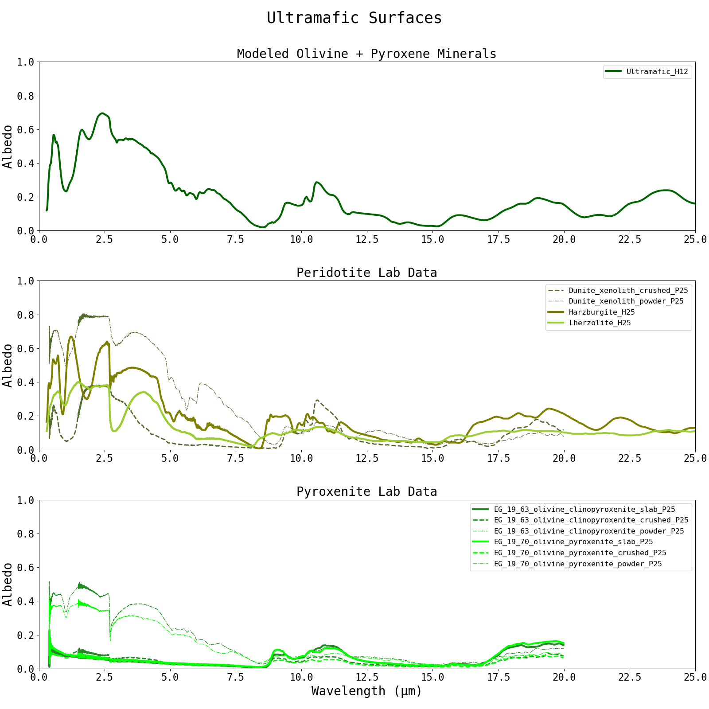
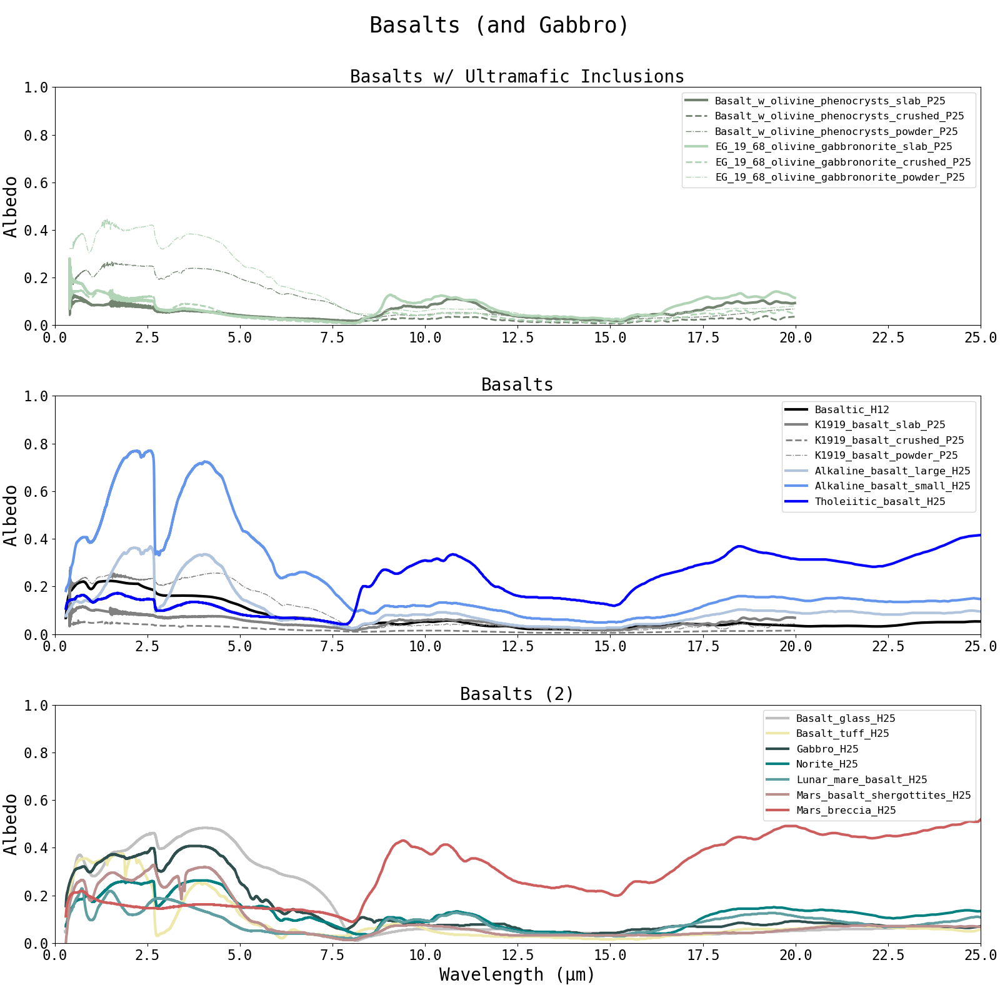
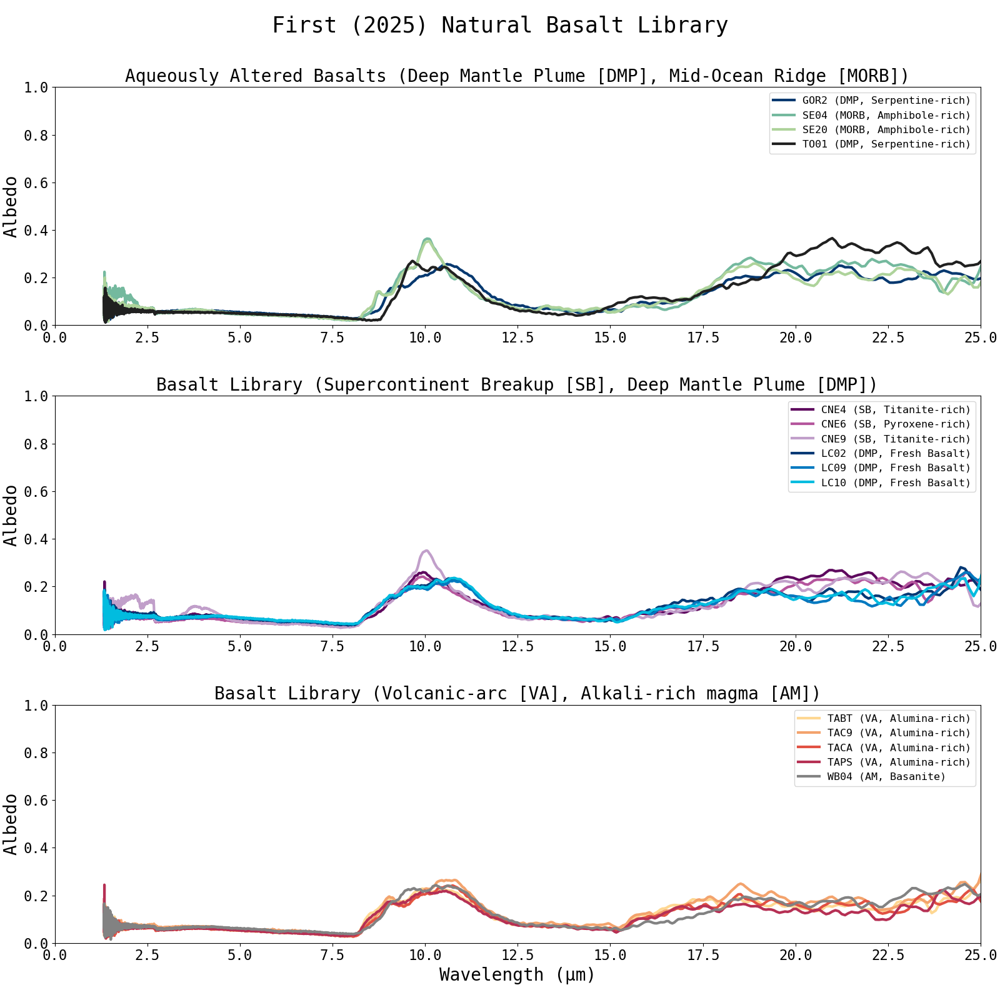
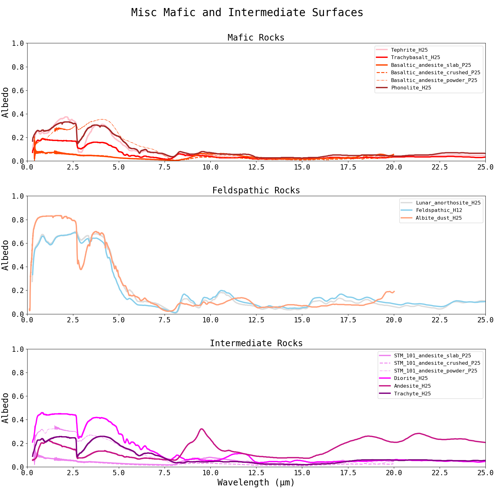
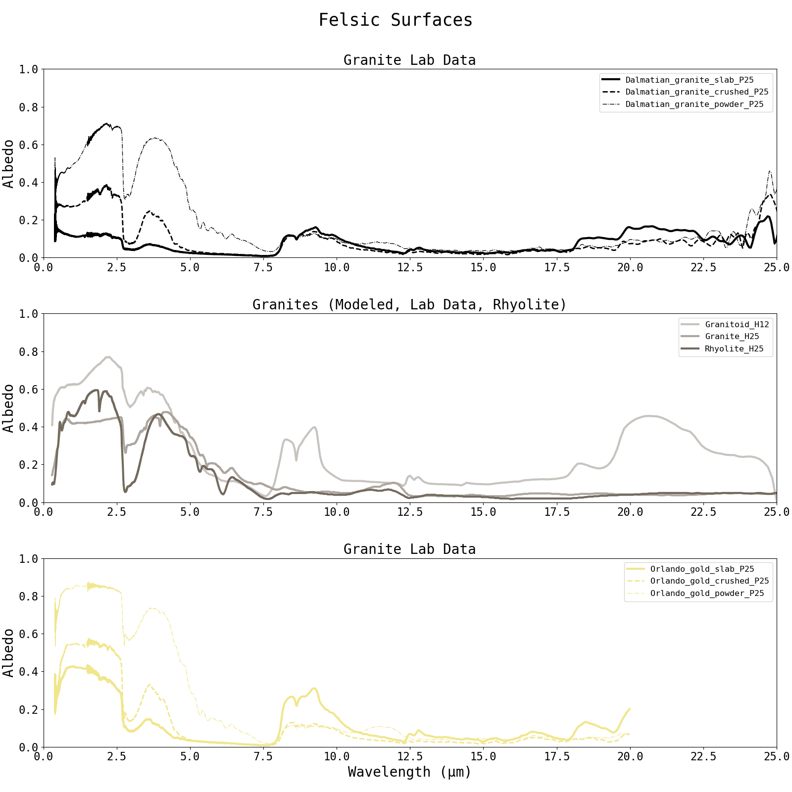
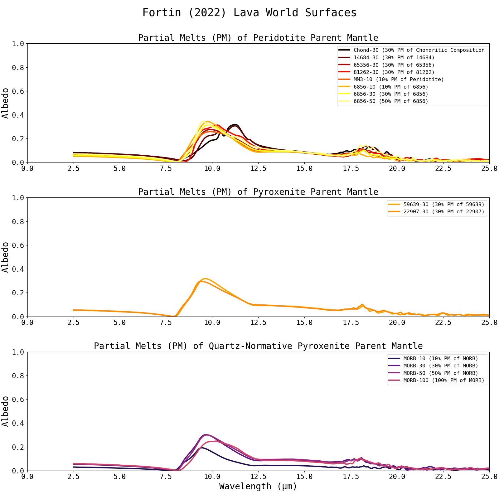
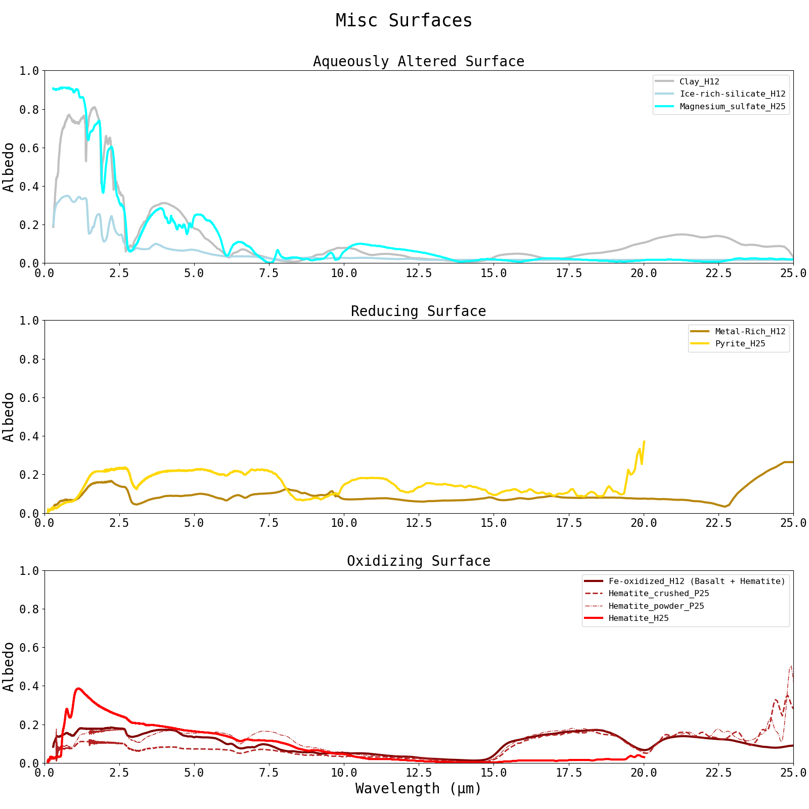
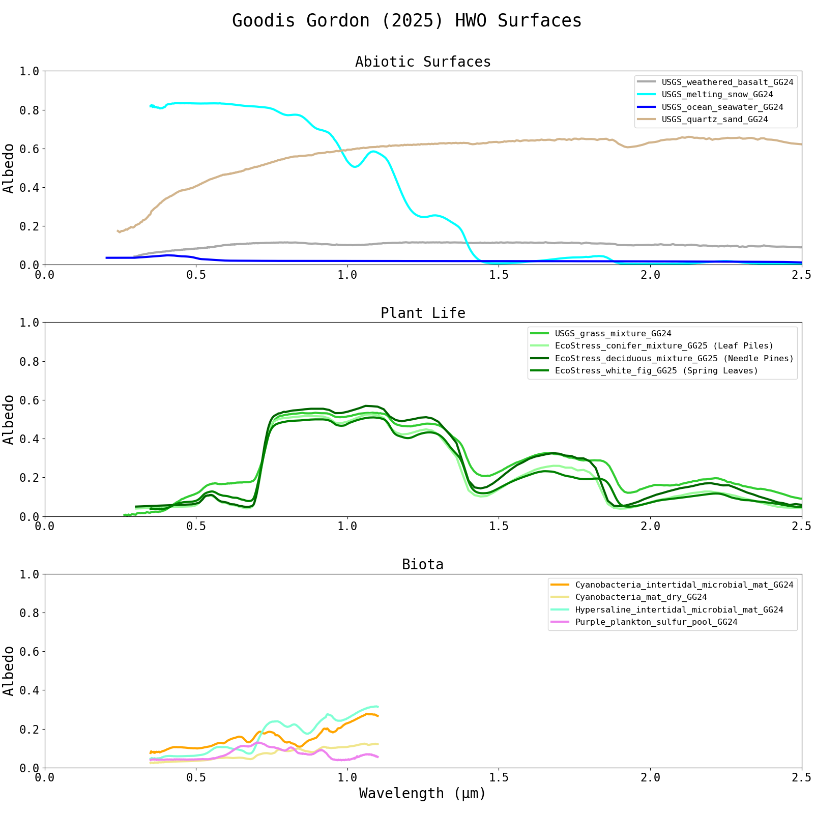
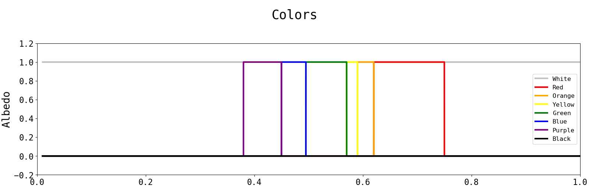
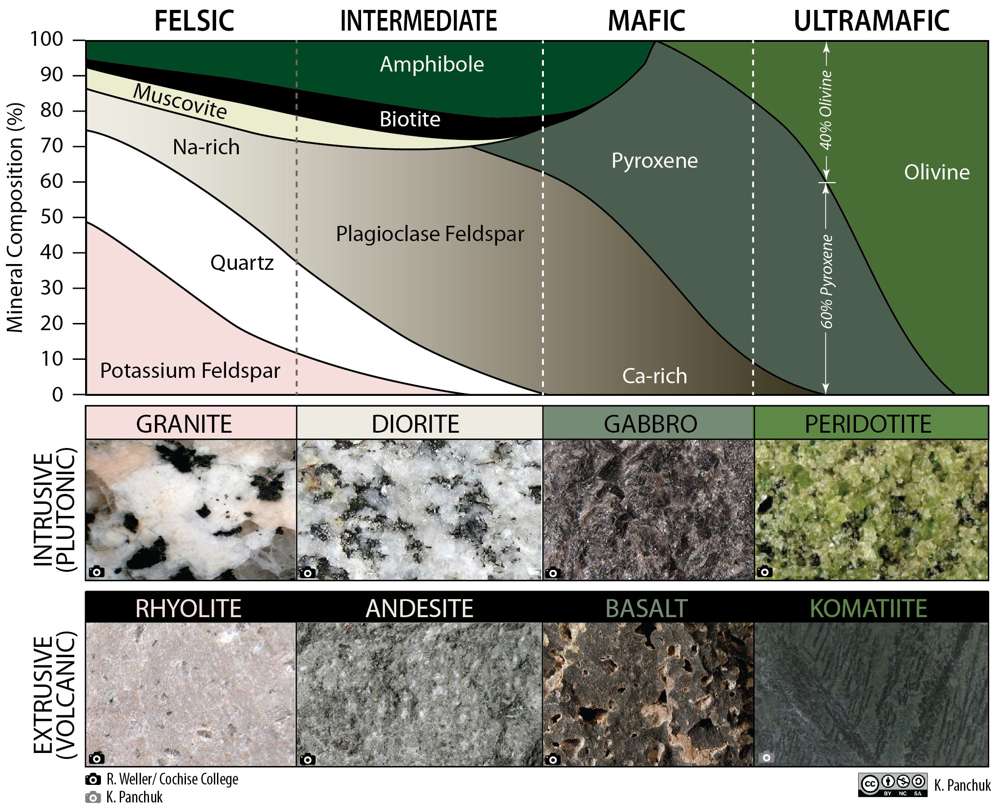

Surface Albedo Database
================

Surface albedos, curated from lab data, can be used when modeling the emission and/or 
reflection spectra of rocky planets with a hard surface. This albedo database was introduced 
in the POSEIDON v1.4 update. 

Geology Supplemental Material 
___________________________
Many of the albedos curated in the databse are linked to specific minerals and rocks.

In order to foster future collaboration between geologists and exoplanet scientists, 
in the appendix of Mullens et al 2026 (the POSEIDON v1.4 paper) there are 
supplemental tables developed to elucidate the albedos included in this database. 
If unfamiliar with different rocks and minerals, we reccomend users to read these tables. 
The full list of tables can be found `here <../_static/Mullens2026.pdf>`_

For a primer on relevant geology terms and their connection to exoplanet science, see 
Table A1. 

For geological categories, which includes definitions and the Solar System context of 
rocks and minerals in the datbase, see Table A2. 

For broad surface type categories, which we use here to organize the albedos in our 
opacity previews, and potential consideratios for interpretation if detected, see 
Table A3. 

For in-depth tabulations of the albedo data included in the database, see Tables A4-7. 

Surface Albedo References 
___________________________

As of POSEIDON v1.4, a fresh install of POSEIDON comes with a surface_reflectivies folder 
in the inputs folder. This folder contains the pre-included surface albedos (as .txt files) 
from the following sources. The last portion of the albedo name signifigies its source (i.e., _H12 = Hu 2012)

All albedos presented in the database are in the form directional-hemispherical reflectances
(with the exception of the albedos from Goodis Gordon (2025), see Table A7). 

Users can simply add their own lab data: just generate a txt file with the first column being 
wavelength, second column being albedo, and place it in the 'surface_reflectivities' folder. 
POSEIDON will automatically detect whether or not their is a txt file with the name matching 
that of the albedo defined in the 'surface_components' list in model initialization. 

We recommend that users try to ensure that their data is in the form of directional-hemispherical 
reflectance (for more details, see Appendix A in Mullens et al (2026)).

`Hu (2012) [H12] <https://ui.adsabs.harvard.edu/abs/2012ApJ...752....7H/abstract>`_
:math:`\hookrightarrow ` Txt files found `here <https://github.com/MartianColonist/POSEIDON/tree/Mie-HotFix-w-Surfaces/POSEIDON/reference_data/surface_reflectivities_txt_files/Hu2012-H12>`_ 

`Fortin (2022) [F22] <https://ui.adsabs.harvard.edu/abs/2022MNRAS.516.4569F/abstract>`_
:math:`\hookrightarrow ` Txt files found `here <https://github.com/MartianColonist/POSEIDON/tree/Mie-HotFix-w-Surfaces/POSEIDON/reference_data/surface_reflectivities_txt_files/Fortin2022-F22>`_ 

`First (2025) [F25] <https://ui.adsabs.harvard.edu/abs/2025NatAs...9..370F/abstract>`_
:math:`\hookrightarrow ` Txt files found `here <https://github.com/MartianColonist/POSEIDON/tree/Mie-HotFix-w-Surfaces/POSEIDON/reference_data/surface_reflectivities_txt_files/First2025-F25>`_ 

`Goodis Gordon (2025) [G25] <https://ui.adsabs.harvard.edu/abs/2025ApJ...983..168G/abstract>`_
:math:`\hookrightarrow ` Txt files found `here <https://github.com/MartianColonist/POSEIDON/tree/Mie-HotFix-w-Surfaces/POSEIDON/reference_data/surface_reflectivities_txt_files/GoodisGordon2025-G25>`_ 

`Hammond (2025) [H25] <https://ui.adsabs.harvard.edu/abs/2025ApJ...978L..40H/abstract>`_
:math:`\hookrightarrow ` Txt files found `here <https://github.com/MartianColonist/POSEIDON/tree/Mie-HotFix-w-Surfaces/POSEIDON/reference_data/surface_reflectivities_txt_files/Hammond2025-H25>`_ 

`Paragas (2025) [P25] <https://ui.adsabs.harvard.edu/abs/2025ApJ...981..130P/abstract>`_
:math:`\hookrightarrow ` Txt files found `here <https://github.com/MartianColonist/POSEIDON/tree/Mie-HotFix-w-Surfaces/POSEIDON/reference_data/surface_reflectivities_txt_files/Paragas-P25>`_ 

Miscellaneous (i.e., colors) txt files found `here <https://github.com/MartianColonist/POSEIDON/tree/Mie-HotFix-w-Surfaces/POSEIDON/reference_data/surface_reflectivities_txt_files/Misc>`_ 

Surface Albedo Previews  
___________________________

Additional Resources 
___________________________

These are additional figures that can be used, alongside the Appendix tables, to better understand 
entries in the surface albedo database. 

Mineral composition of igenous rocks

:math:`\hookrightarrow ` sourced from `here <https://pressbooks.bccampus.ca/geoclone/chapter/7-3-classification-of-igneous-rocks-2/>`_ 

Total-Alkali Silica diagram 

.. image:: ../_static/opacity_previews/surfaces/tas_diagram.png
   :width: 50
   :align: center

:math:`\hookrightarrow ` sourced from `here <https://www.mindat.org/glossary/tas_classification>`_ 
