.. _POSEIDON_Papers:

Press Releases POSEIDON was part of
===============

POSEIDON Paper Timeline
===============

Each list includes the ADS link and a figure 
for visual reference. 

Pre Release

MacDonald & Madhusudhan (2017a)
^^^^^^^^^^^^^^^^^^^^^^^^^^^^^^^
`HD 209458b in new light: evidence of nitrogen chemistry, patchy clouds and sub-solar water`
`ADS Link <https://ui.adsabs.harvard.edu/abs/2017MNRAS.469.1979M/abstract>`_
Developed: 2D transmission retrievals, patchy generalized clouds, free chemistry
.. image:: ../_static/paper_images/MacDonald_Madhu_2017a.png
   :alt: Sample image
   :width: 400px
   :align: center

MacDonald & Madhusudhan (2017b)
^^^^^^^^^^^^^^^^^^^^^^^^^^^^^^^
`Signatures of Nitrogen Chemistry in Hot Jupiter Atmospheres`
`ADS Link <https://ui.adsabs.harvard.edu/abs/2017ApJ...850L..15M/abstract>`_
Utilized: Free chemistry, transmission retrieval 
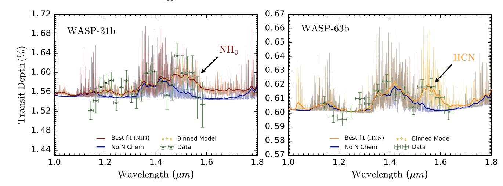

Sedaghati (2017)
^^^^^^^^^^^^^^^^
`Detection of titanium oxide in the atmosphere of a hot Jupiter`
`ADS Link <https://ui.adsabs.harvard.edu/abs/2017Natur.549..238S/abstract>`_
Utilized: Free chemistry, haze, transmission retrieval
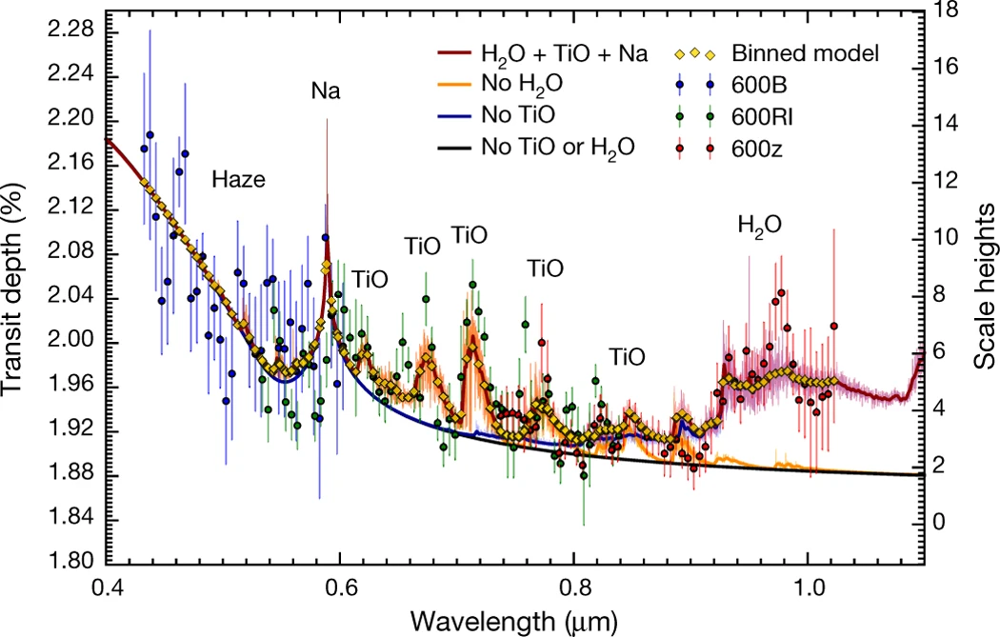

MacDonald & Madhusudhan (2019) 
^^^^^^^^^^^^^^^^
`The metal-rich atmosphere of the exo-Neptune HAT-P-26b`
`ADS Link <https://ui.adsabs.harvard.edu/abs/2019MNRAS.486.1292M/abstract>`_
Utilized: Free chemistry transmission retrieval 
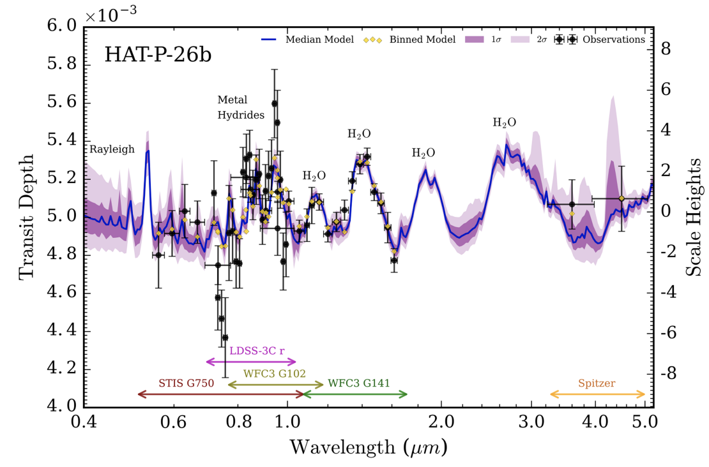

MacDonald & Goyal & Lewis (2020) 
^^^^^^^^^^^^^^^^
`Why Is it So Cold in Here? Explaining the Cold Temperatures Retrieved from Transmission Spectra of Exoplanet Atmospheres`
`ADS Link <https://ui.adsabs.harvard.edu/abs/2020ApJ...893L..43M/abstract>`_
Utilized: 2D transmission forward model, free chemistry transmission retrieval
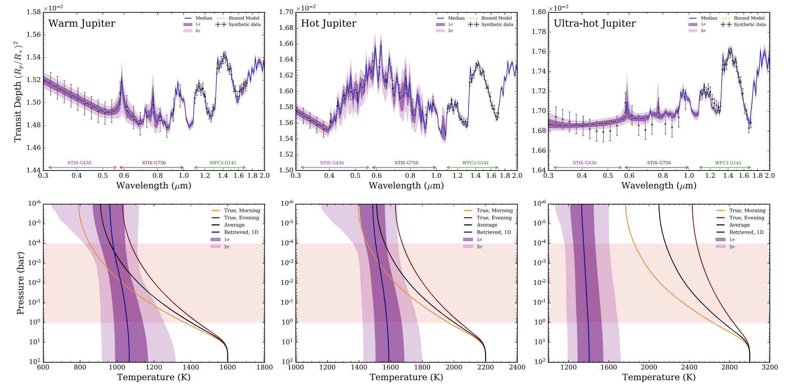

Kaltenegger & MacDonald (2020) 
^^^^^^^^^^^^^^^^
`The White Dwarf Opportunity: Robust Detections of Molecules in Earth-like Exoplanet Atmospheres with the James Webb Space Telescope`
`ADS Link <https://ui.adsabs.harvard.edu/abs/2020ApJ...901L...1K/abstract>`_
Utilized: Transmission forward model, synthetic JWST data, free chemistry transmission retrieval
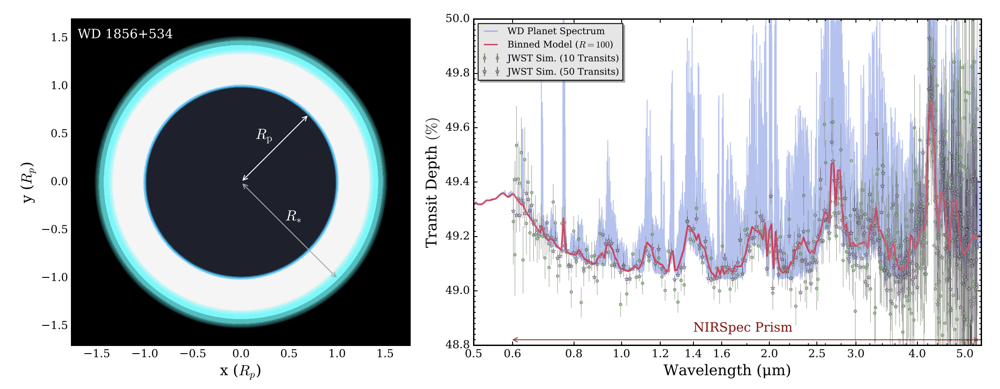

Lewis et al (2020)
^^^^^^^^^^^^^^^^
`Into the UV: The Atmosphere of the Hot Jupiter HAT-P-41b Revealed`
`ADS Link <https://ui.adsabs.harvard.edu/abs/2020ApJ...902L..19L/abstract>`_
Utilized: Free chemistry transmission retrieval
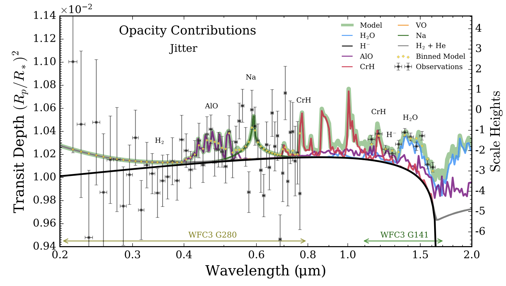

Alam et al (2021)
^^^^^^^^^^^^^^^^
`Evidence of a Clear Atmosphere for WASP-62b: The Only Known Transiting Gas Giant in the JWST Continuous Viewing Zone`
`ADS Link <https://ui.adsabs.harvard.edu/abs/2021ApJ...906L..10A/abstract>`_
Utilized: Free chemistry transmission retrieval
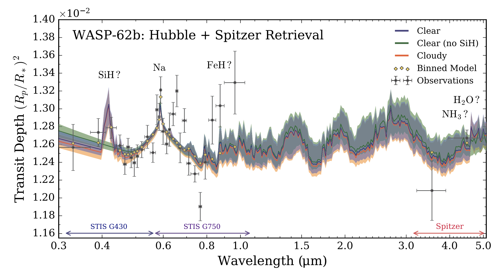

Kirk et al (2021)
^^^^^^^^^^^^^^^^
`ACCESS and LRG-BEASTS: A Precise New Optical Transmission Spectrum of the Ultrahot Jupiter WASP-103b`
`ADS Link <https://ui.adsabs.harvard.edu/abs/2021AJ....162...34K/abstract>`_
Utilized: Free chemistry transmission retrieval with stellar contamination
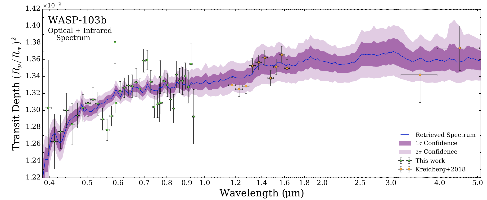

Sedaghati (2021)
^^^^^^^^^^^^^^^^
`A spectral survey of WASP-19b with ESPRESSO`
`ADS Link <https://ui.adsabs.harvard.edu/abs/2021MNRAS.505..435S/abstract>`_
Utilized: Free chemistry transmission retrieval with stellar contamination
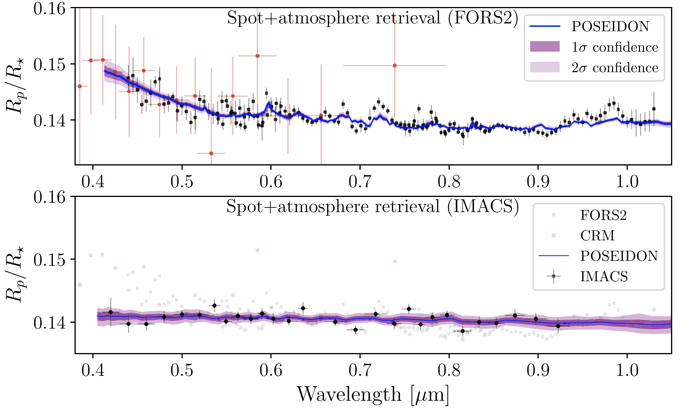

Lin et al (2021)
^^^^^^^^^^^^^^^^
`Differentiating modern and prebiotic Earth scenarios for TRAPPIST-1e: high-resolution transmission spectra and predictions for JWST`
`ADS Link <https://ui.adsabs.harvard.edu/abs/2021MNRAS.505.3562L/abstract>`_
Utilized: Transmission forward model, synthetic JWST data, free chemistry transmission retrieval
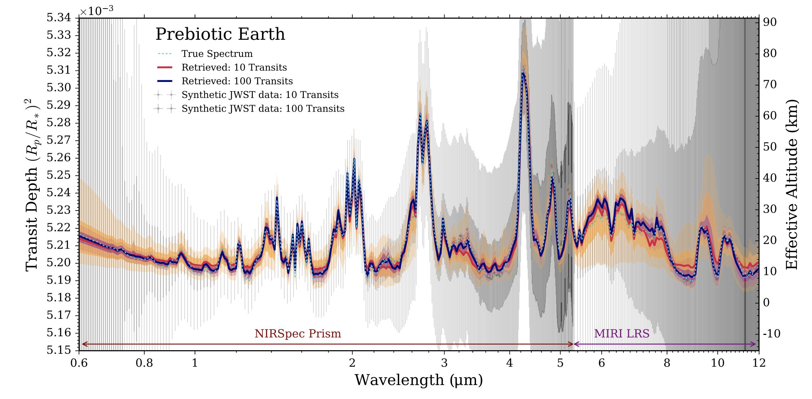

Rathcke et al (2021)
^^^^^^^^^^^^^^^^
`HST PanCET Program: A Complete Near-UV to Infrared Transmission Spectrum for the Hot Jupiter WASP-79b`
`ADS Link <https://ui.adsabs.harvard.edu/abs/2021AJ....162..138R/abstract>`_
Utilized: Free chemistry transmission retrieval with stellar contamination and parameterized clouds
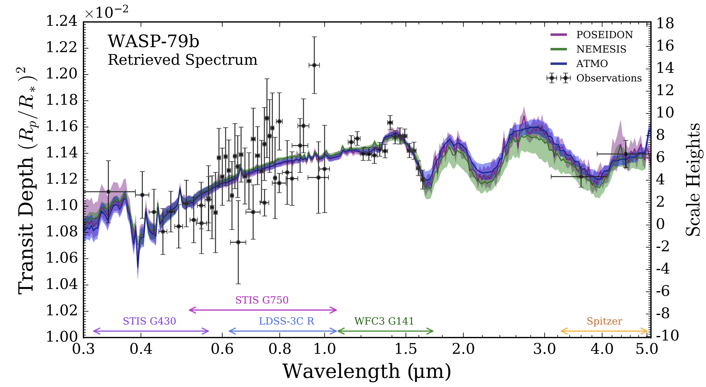

Xu et al (2021)
^^^^^^^^^^^^^^^^
`Gemini/GMOS Transmission Spectroscopy of the Grazing Planet Candidate WD 1856+534 b`
`ADS Link <https://ui.adsabs.harvard.edu/abs/2021AJ....162..296X/abstract>`_
Utilized: Transmission forward model, grazing transit 
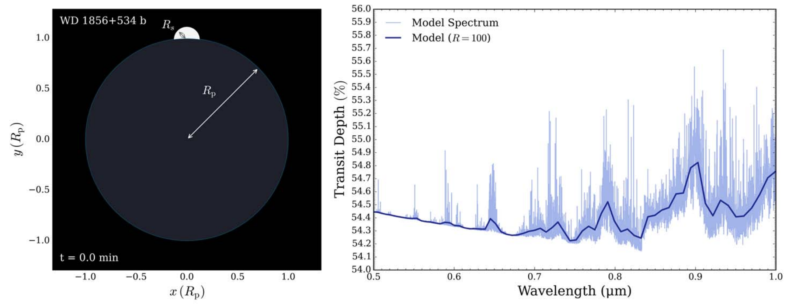

MacDonald & Lewis (2022) 
^^^^^^^^^^^^^^^^
`TRIDENT: A Rapid 3D Radiative-transfer Model for Exoplanet Transmission Spectra`
`ADS Link <https://ui.adsabs.harvard.edu/abs/2022ApJ...929...20M/abstract>`_
Developed: 3D radiative transfer used in POSEIDON’s transmission spectroscopy
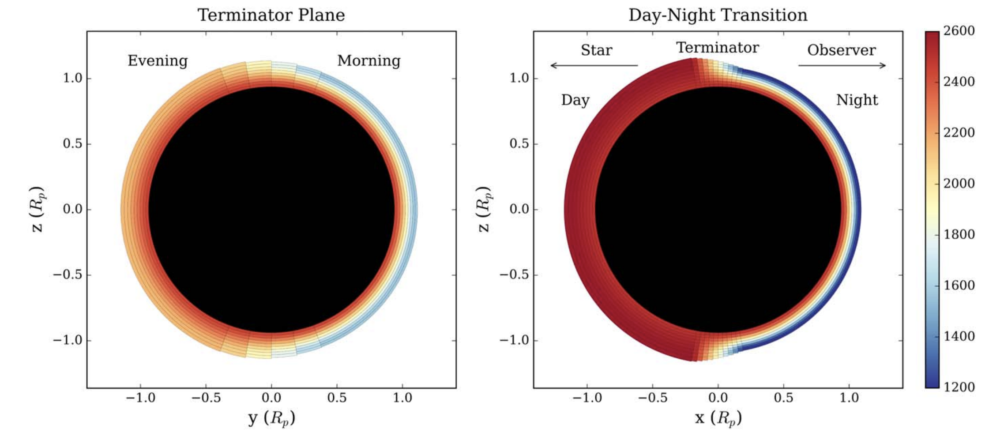

Barstow et al (2022) 
^^^^^^^^^^^^^^^^
`A retrieval challenge exercise for the Ariel mission`
`ADS Link <https://ui.adsabs.harvard.edu/abs/2022ExA....53..447B/abstract>`_
Utilized: Free chemistry transmission retrieval 
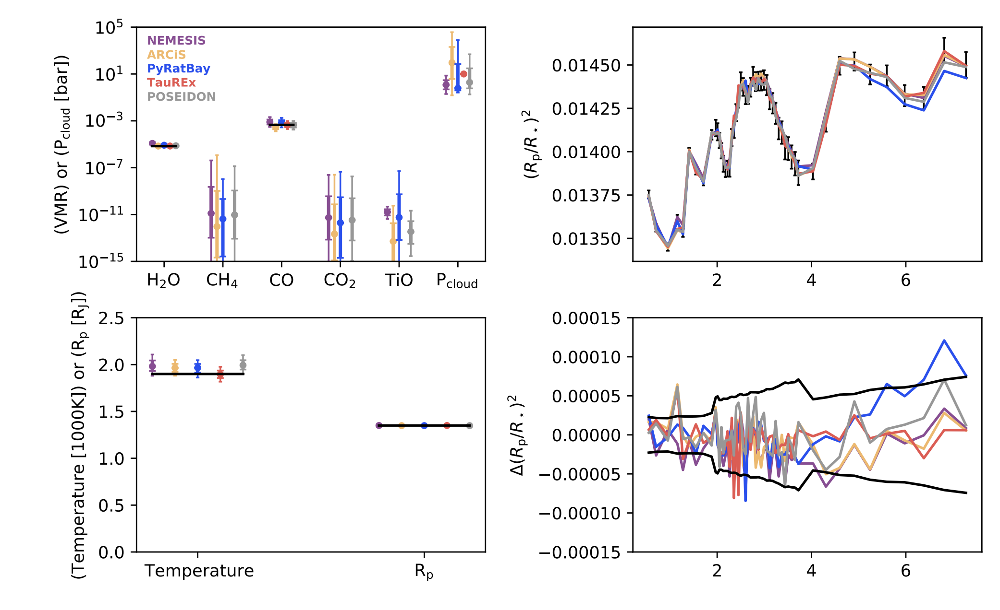

Alderson et al (2022) 
^^^^^^^^^^^^^^^^
`A comprehensive analysis of WASP-17b's transmission spectrum from space-based observations`
`ADS Link <https://ui.adsabs.harvard.edu/abs/2022MNRAS.512.4185A/abstract>`_
Utilized: Free chemistry transmission retrieval, parameterized clouds
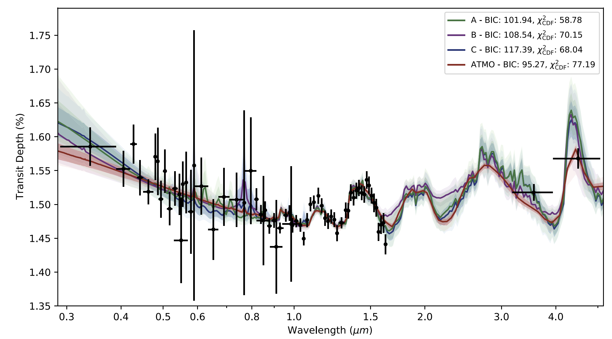

POSEIDON 1.0 Released! (January 2023) (Lead Developer: Ryan MacDonald)

MacDonald (2023)
^^^^^^^^^^^^^^^^
`POSEIDON: A Multidimensional Atmospheric Retrieval Code for Exoplanet Spectra`
`ADS Link <https://ui.adsabs.harvard.edu/abs/2023JOSS....8.4873M/abstract>`_
Developed: Open-source version of POSEIDON
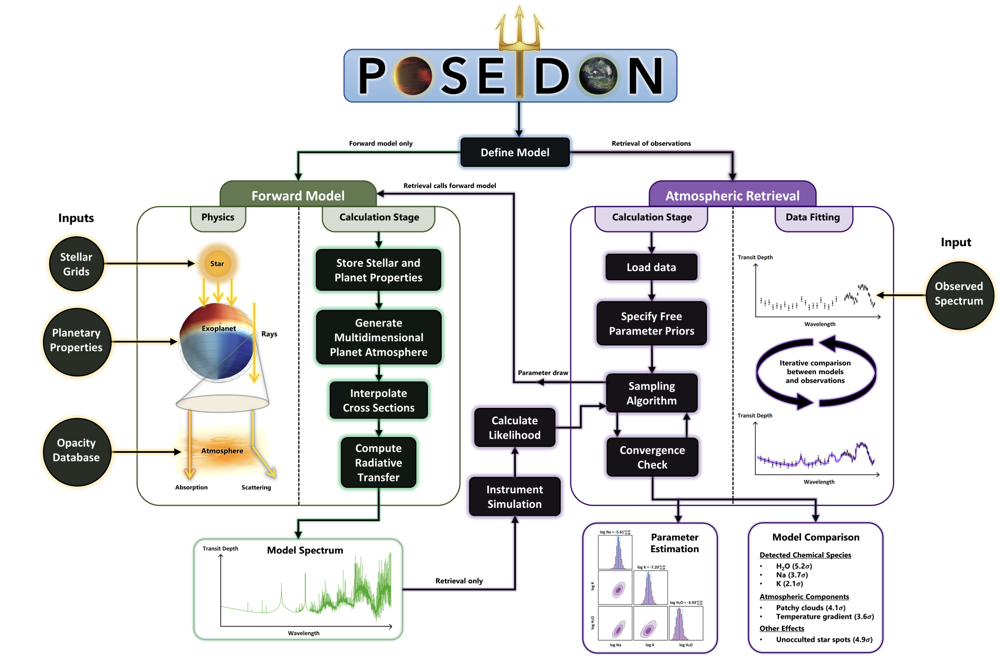

Rackham et al (2023)
^^^^^^^^^^^^^^^^
`The effect of stellar contamination on low-resolution transmission spectroscopy: needs identified by NASA's Exoplanet Exploration Program Study Analysis Group 21`
`ADS Link <https://ui.adsabs.harvard.edu/abs/2023RASTI...2..148R/abstract>`_
Utilized: Free chemistry transmission retrieval with stellar contamination
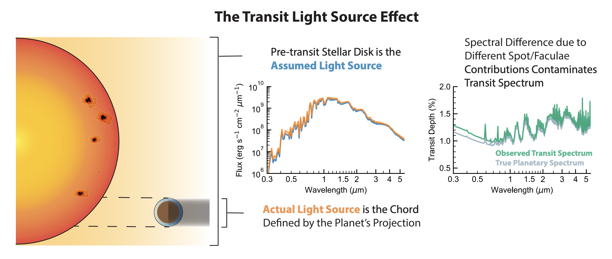

MacDonald & Batalha (2023) 
^^^^^^^^^^^^^^^^
`A Catalog of Exoplanet Atmospheric Retrieval Codes`
`ADS Link <https://ui.adsabs.harvard.edu/abs/2023RNAAS...7...54M/abstract>`_
Developed: Catalog of Retrieval Codes

Moran et al (2023)
^^^^^^^^^^^^^^^^
`High Tide or Riptide on the Cosmic Shoreline? A Water-rich Atmosphere or Stellar Contamination for the Warm Super-Earth GJ 486b from JWST Observations`
`ADS Link <https://ui.adsabs.harvard.edu/abs/2023ApJ...948L..11M/abstract>`_
Utilized: Free chemistry transmission retrieval with stellar contamination
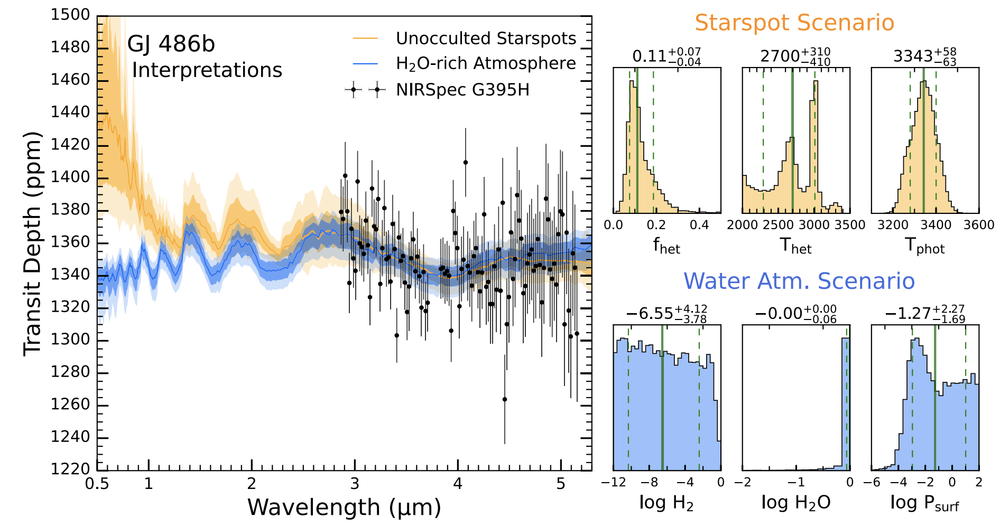

POSEIDON 1.1 Released! (June 2023) (Lead Developers: Ryan MacDonald (Stellar Contamination), Ruizhe Wang (Equilibrium Chemistry Grid), Elijah Mullens (Contributor to Equilibrium Chemistry))

Coulombe et al (2023)
^^^^^^^^^^^^^^^^
`A broadband thermal emission spectrum of the ultra-hot Jupiter WASP-18b`
`ADS Link <https://ui.adsabs.harvard.edu/abs/2023Natur.620..292C/abstract>`_
Utilized: Free chemistry single-stream emission retrieval 
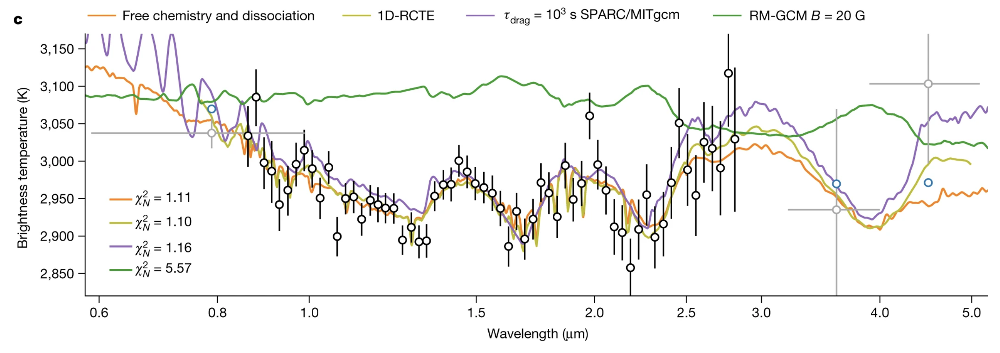

Lim et al (2023)
^^^^^^^^^^^^^^^^
`Atmospheric Reconnaissance of TRAPPIST-1 b with JWST/NIRISS: Evidence for Strong Stellar Contamination in the Transmission Spectra`
`ADS Link <https://ui.adsabs.harvard.edu/abs/2023ApJ...955L..22L/abstract>`_
Utilized: Free chemistry transmission retrievals with stellar contaminations, CLR prior 
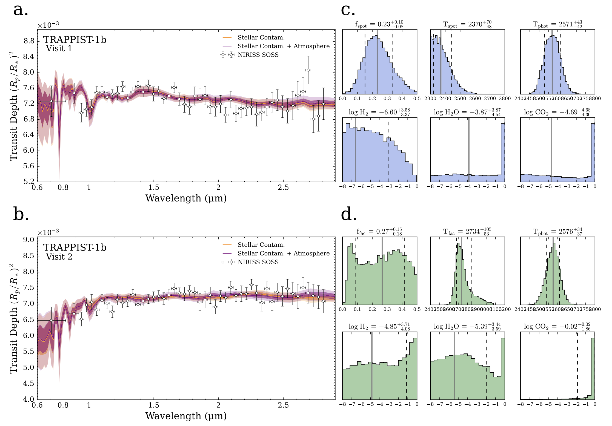

Taylor et al (2023)
^^^^^^^^^^^^^^^^
`Awesome SOSS: atmospheric characterization of WASP-96 b using the JWST early release observations`
`ADS Link <https://ui.adsabs.harvard.edu/abs/2023MNRAS.524..817T/abstract>`_
Utilized: Free chemistry transmission retrieval 
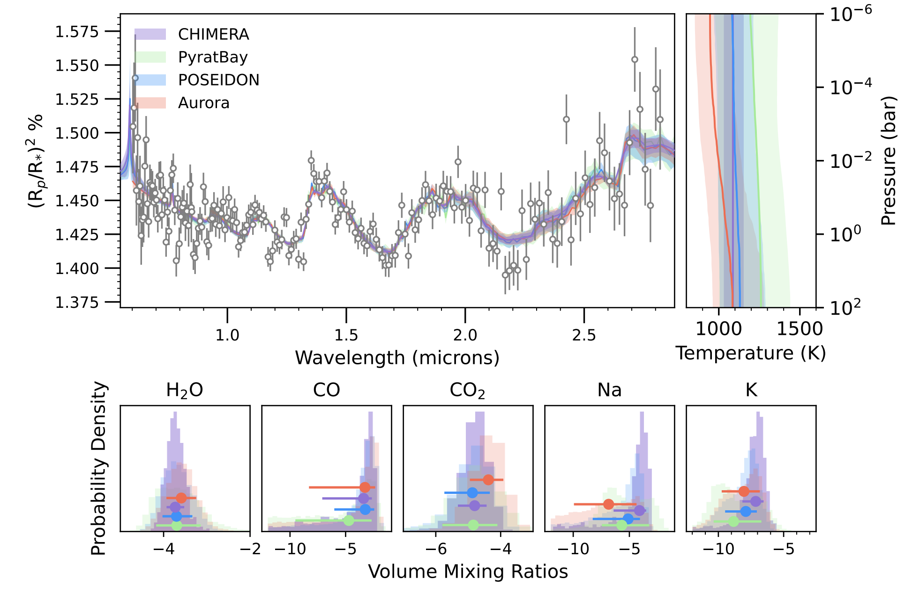

Barrientos, Kaltenegger, & MacDonald (2023)
^^^^^^^^^^^^^^^^
`A Venus in the making? Predictions for JWST observations of the ultracool M-dwarf planet LP 890-9 c`
`ADS Link <https://ui.adsabs.harvard.edu/abs/2023MNRAS.524L...5G/abstract>`_
Utilized: Transmission forward model, synthetic JWST data, free chemistry transmission retrieval
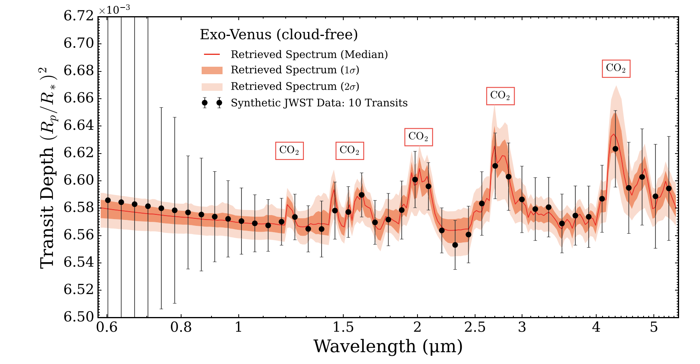

Grant et al (2023)
^^^^^^^^^^^^^^^^
`JWST-TST DREAMS: Quartz Clouds in the Atmosphere of WASP-17b`
`ADS Link <https://ui.adsabs.harvard.edu/abs/2023ApJ...956L..32G/abstract>`_
Utilized: Free chemistry transmission retrieval, Mie-scattering aerosols, dataset offsets
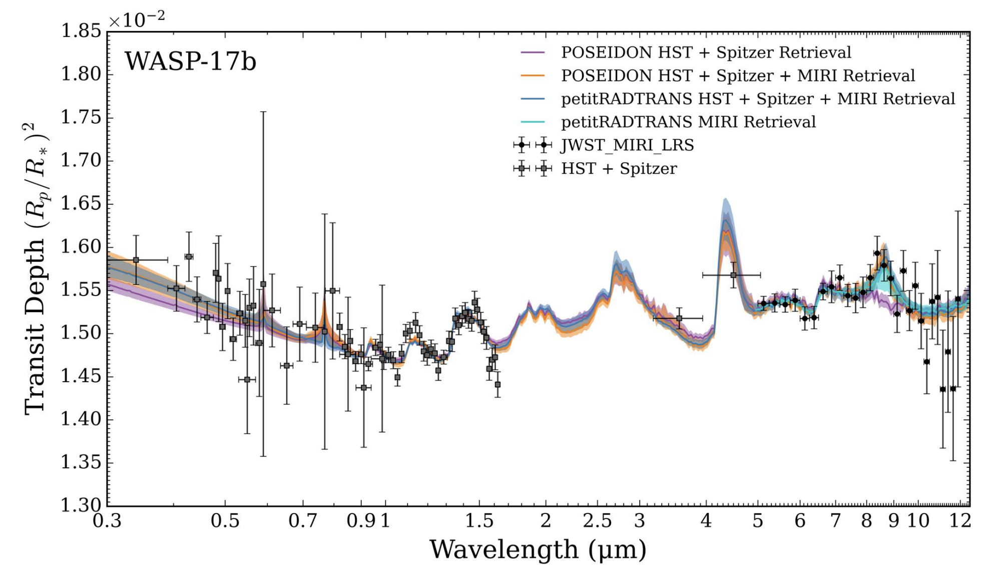

Lustig-Yaeger et al (2023)
^^^^^^^^^^^^^^^^
`A JWST transmission spectrum of the nearby Earth-sized exoplanet LHS 475 b`
`ADS Link <https://ui.adsabs.harvard.edu/abs/2023NatAs...7.1317L/abstract>`_
Utilized: Free chemistry transmission retrieval, CLR prior, stellar contamination
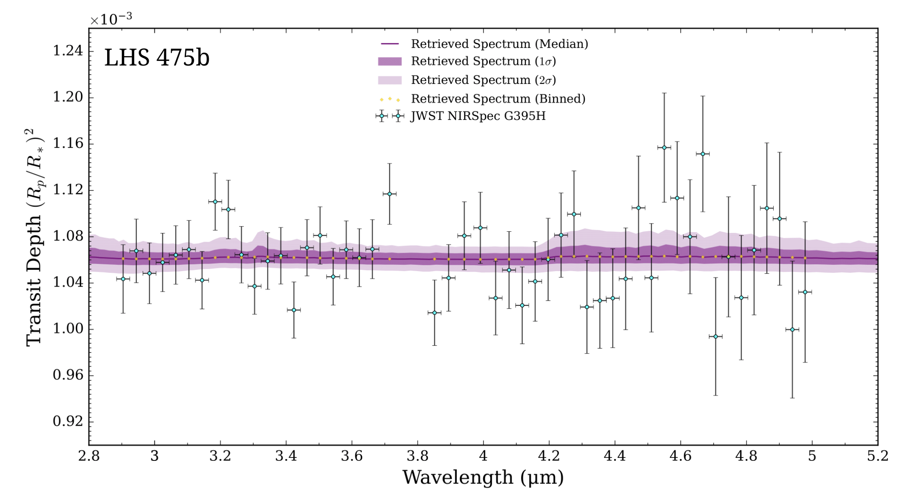

May et al (2023)
^^^^^^^^^^^^^^^^
`Double Trouble: Two Transits of the Super-Earth GJ 1132 b Observed with JWST NIRSpec G395H`
`ADS Link <https://ui.adsabs.harvard.edu/abs/2023ApJ...959L...9M/abstract>`_
Utilized: Free chemistry transmission retrieval with stellar contamination
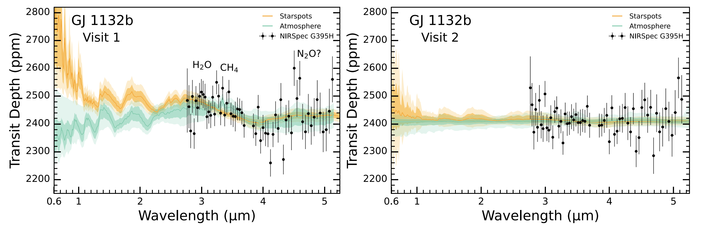

Fournier-Tondreau et al (2024)
^^^^^^^^^^^^^^^^
`Near-infrared transmission spectroscopy of HAT-P-18 b with NIRISS: Disentangling planetary and stellar features in the era of JWST`
`ADS Link <https://ui.adsabs.harvard.edu/abs/2024MNRAS.528.3354F/abstract>`_
Utilized: Free chemistry transmission retrieval with stellar contamination
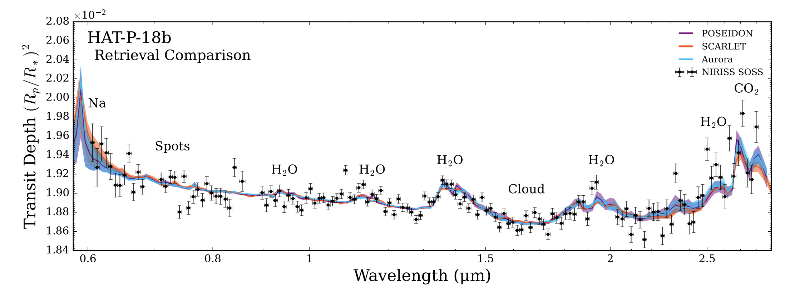

Fairman, Wakeford, & MacDonald (2024)
^^^^^^^^^^^^^^^^
`The Importance of Optical Wavelength Data on Atmospheric Retrievals of Exoplanet Transmission Spectra`
`ADS Link <https://ui.adsabs.harvard.edu/abs/2024AJ....167..240F/abstract>`_
Utilized: Free chemistry transmission retrieval, parameterized clouds
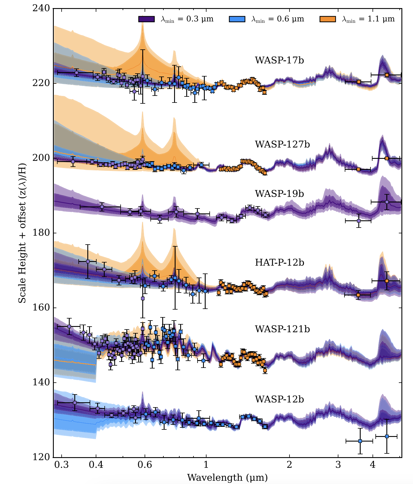

Cadieux et al (2024)
^^^^^^^^^^^^^^^^
`Transmission Spectroscopy of the Habitable Zone Exoplanet LHS 1140 b with JWST/NIRISS`
`ADS Link <https://ui.adsabs.harvard.edu/abs/2024ApJ...970L...2C/abstract>`_
Utilized: Free chemistry transmission retrieval with stellar contamination
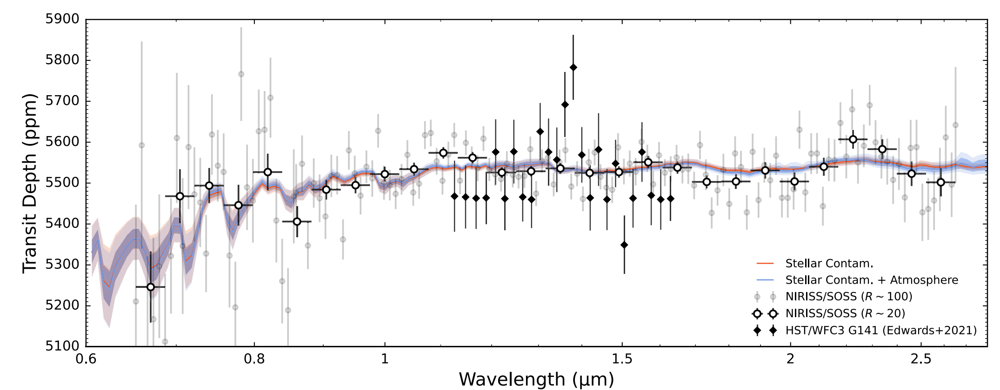

Valentine et al (2024)
^^^^^^^^^^^^^^^^
`JWST-TST DREAMS: Nonuniform Dayside Emission for WASP-17b from MIRI/LRS`
`ADS Link <https://ui.adsabs.harvard.edu/abs/2024AJ....168..123V/abstract>`_
Utilized: Aerosol database
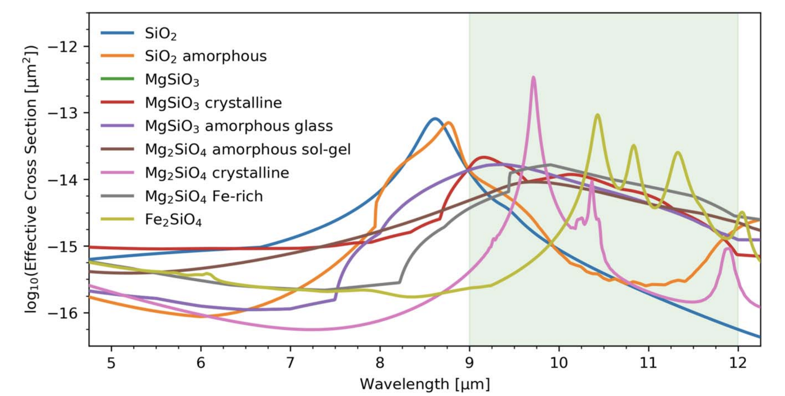

Limbach et al (2024)
^^^^^^^^^^^^^^^^
`The MIRI Exoplanets Orbiting White dwarfs (MEOW) Survey: Mid-infrared Excess Reveals a Giant Planet Candidate around a Nearby White Dwarf`
`ADS Link <https://ui.adsabs.harvard.edu/abs/2024ApJ...973L..11L/abstract>`_
Utilized: Blackbody thermal emission 
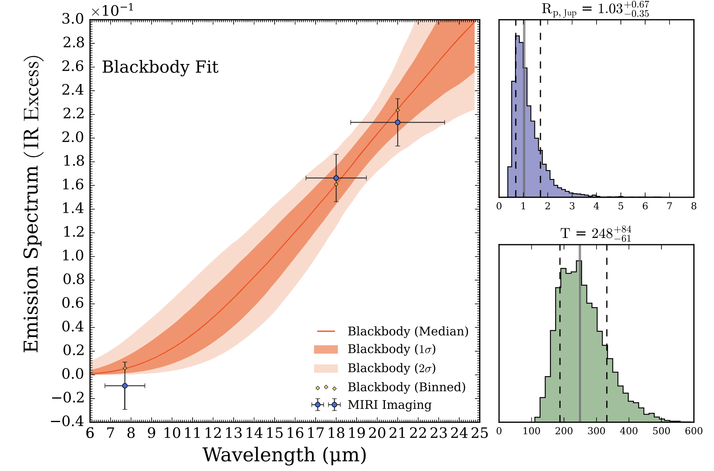

Piaulet-Ghorayeb et al (2024)
^^^^^^^^^^^^^^^^
`JWST/NIRISS Reveals the Water-rich "Steam World" Atmosphere of GJ 9827 d`
`ADS Link <https://ui.adsabs.harvard.edu/abs/2024ApJ...974L..10P/abstract>`_
Utilized: Free chemistry transmission retrieval with stellar contamination, CLR prior
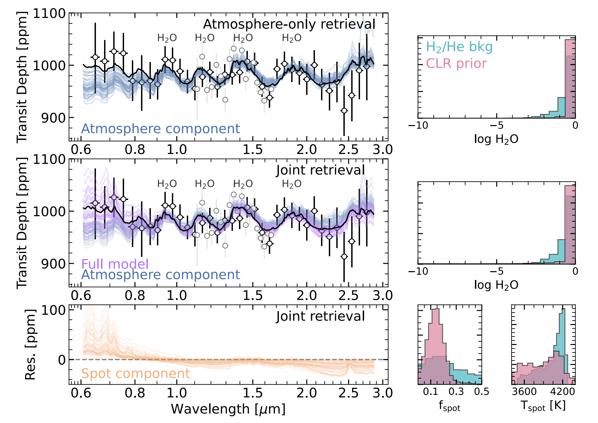

Agrawal & MacDonald (2024)
^^^^^^^^^^^^^^^^
`Cthulhu: An Open Source Molecular and Atomic Cross Section Computation Code for Substellar Atmospheres`
`ADS Link <https://ui.adsabs.harvard.edu/abs/2024JOSS....9.6894A/abstract>`_
Developed: Open-source code to compute cross sections for POSEIDON
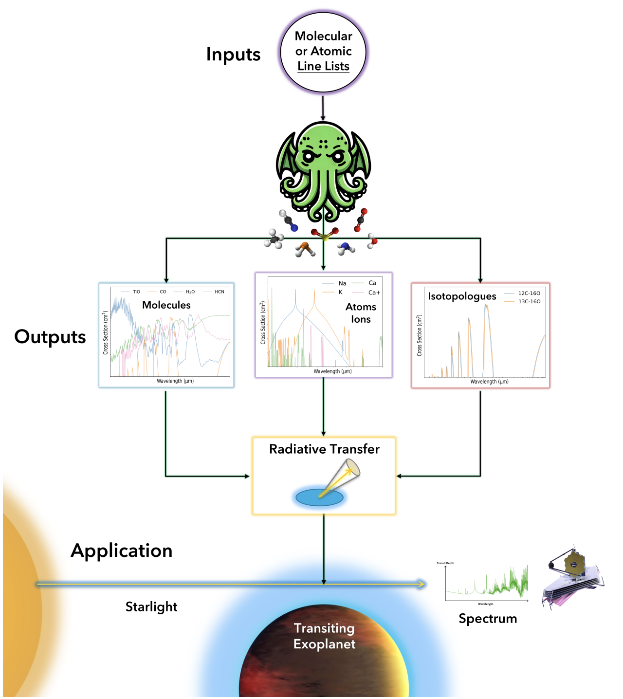

Kappelmeier, MacDonald, & Lewis (2024)
^^^^^^^^^^^^^^^^
`From the Shadows: The Impact of Nightside Thermal Emission on Ultrahot Jupiter Transmission Spectrum Retrievals`
`ADS Link <https://ui.adsabs.harvard.edu/abs/2024ApJ...975...61K/abstract>`_
Developed: Nightside thermal emission contamination in transmission spectra
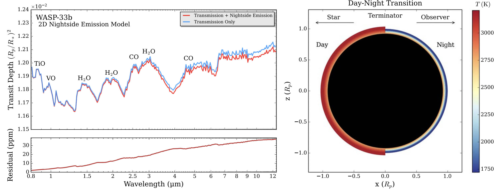

POSEIDON 1.2 Released! (September 2024) (Lead Developers: Elijah Mullens (Aerosols, Scattering + Reflection, Contribution Visuals, etc.), Ryan MacDonald (New Opacity Database), Charlotte Fairman (Contributor to Aerosol Models))

Mullens, Lewis, & MacDonald (2024)
^^^^^^^^^^^^^^^^
`Implementation of Aerosol Mie Scattering in POSEIDON with Application to the Hot Jupiter HD 189733 b's Transmission, Emission, and Reflected Light Spectrum`
`ADS Link <https://ui.adsabs.harvard.edu/abs/2024ApJ...977..105M/abstract>`_
Developed: Mie scattering aerosols in transmission and emission, two-stream thermal scattering, reflection, contribution (spectral + pressure) visuals, precomputed aerosol database, gas opacity updates, PT profiles (Guillot, Line, Pelletier). 
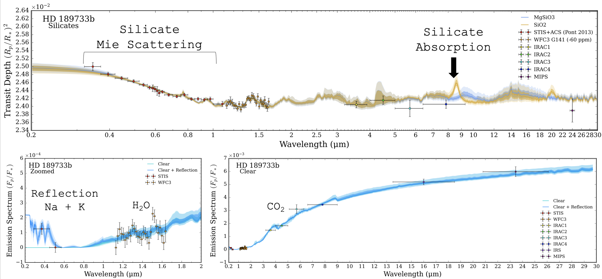

Fournier-Tondreau et al (2024)
^^^^^^^^^^^^^^^^
`Transmission spectroscopy of WASP-52 b with JWST NIRISS: water and helium atmospheric absorption, alongside prominent star-spot crossings`
`ADS Link <https://ui.adsabs.harvard.edu/abs/2024arXiv241217072F/abstract>`_
Utilized: Free chemistry transmission retrieval with stellar contamination, parameterized patchy clouds, and a data offset
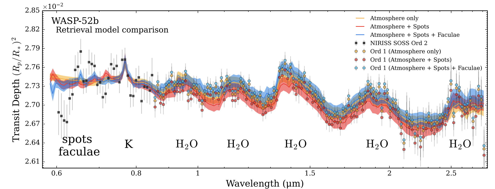

Boehm et al (2025)
^^^^^^^^^^^^^^^^
`The HUSTLE Program: The UV to Near-infrared HST WFC3/UVIS G280 Transmission Spectrum of WASP-127b`
`ADS Link <https://ui.adsabs.harvard.edu/abs/2025AJ....169...23B/abstract>`_
Utilized: Free chemistry transmission retrieval with parameterized patchy clouds
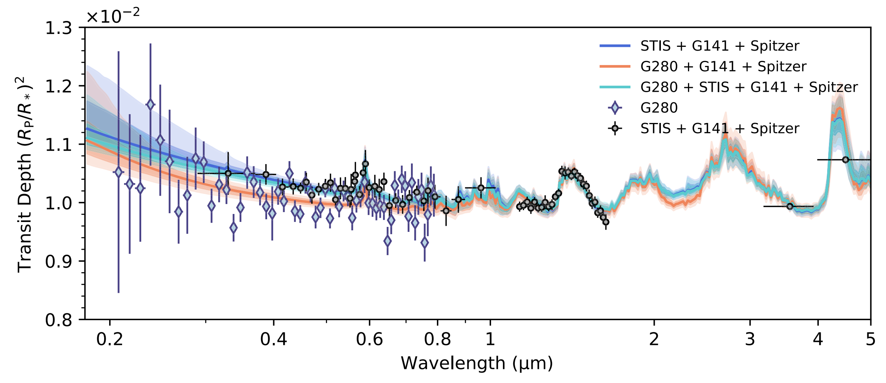

Mayo et al (2025)
^^^^^^^^^^^^^^^^
`Detection of H2O and CO2 in the Atmosphere of the Hot Super-Neptune WASP-166b with JWST`
`ADS Link <https://ui.adsabs.harvard.edu/abs/2025arXiv250100609M/abstract>`_
Utilized: Free chemistry and equilibrium transmission retrievals, contribution visuals 
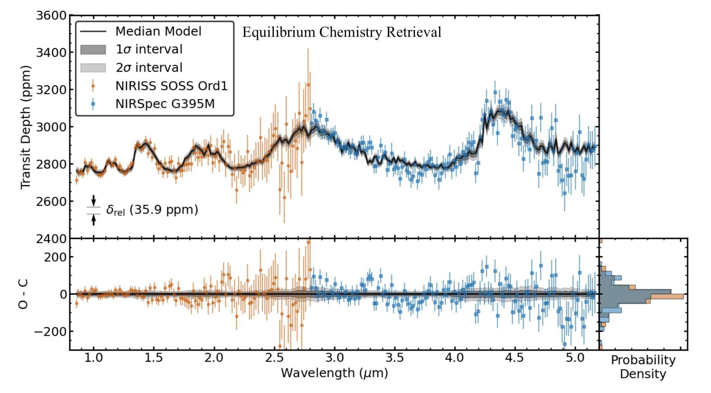

Schmidt et al (2025)
^^^^^^^^^^^^^^^^
`A Comprehensive Reanalysis of K2-18 b's JWST NIRISS+NIRSpec Transmission Spectrum`
`ADS Link <https://ui.adsabs.harvard.edu/abs/2025arXiv250118477S/abstract>`_
Utilized: Free chemistry transmission retrievals, retrieval marginalization
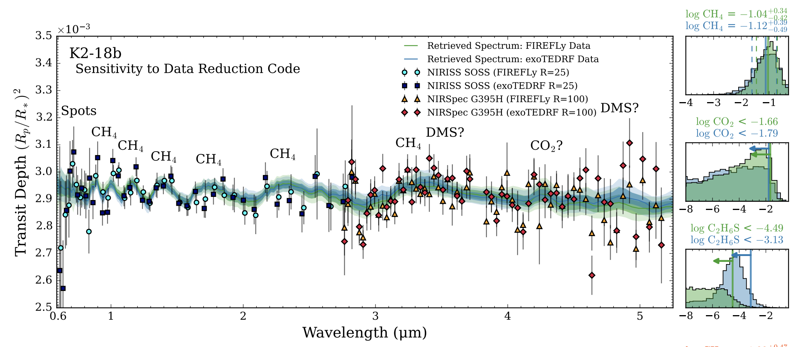

Jacobs et al (2025)
^^^^^^^^^^^^^^^^
`Spectroscopically Resolved Partial Phase Curve of the Rapid Heating and Cooling of the Highly Eccentric Hot Jupiter HAT-P-2b with WFC3`
`ADS Link <https://ui.adsabs.harvard.edu/abs/2025AJ....169...96J/abstract>`_
Utilized: Free chemistry single-stream emission retrievals, pressure contribution ?, slope PT profile
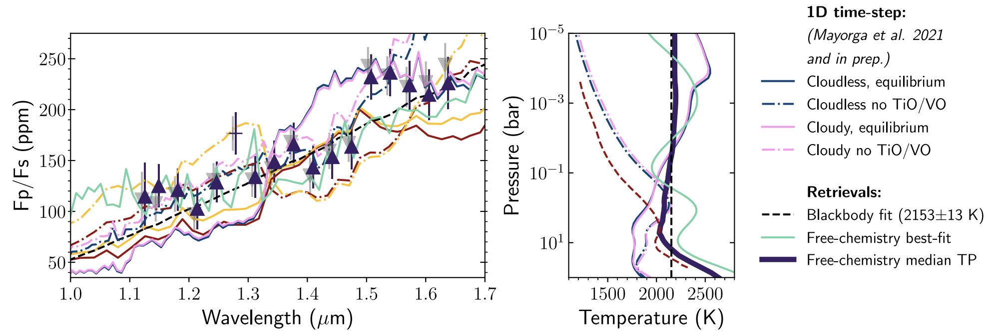

Bello-Arufe et al (2025)
^^^^^^^^^^^^^^^^
`Evidence for a Volcanic Atmosphere on the Sub-Earth L 98-59 b`
`ADS Link <https://ui.adsabs.harvard.edu/abs/2025arXiv250118680B/abstract>`_
Utilized: Free chemistry transmission retrievals, CLR prior 
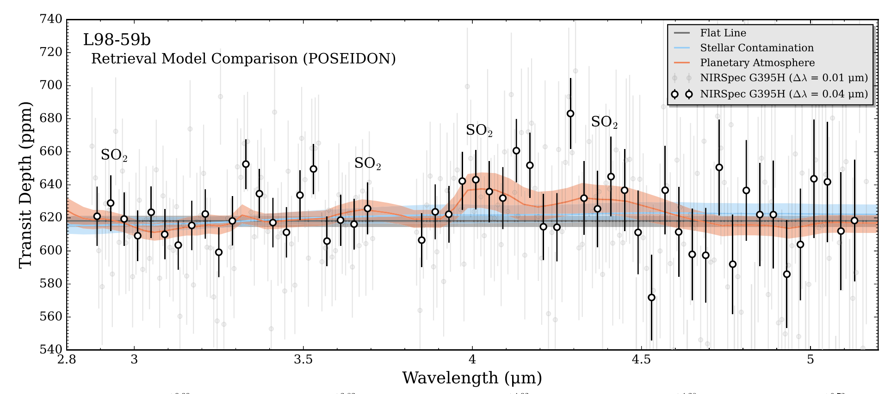

Gressier et al (2025)
^^^^^^^^^^^^^^^^
`JWST-TST DREAMS: A Supersolar Metallicity in WASP-17 b's Dayside Atmosphere from NIRISS SOSS Eclipse Spectroscopy`
`ADS Link <https://ui.adsabs.harvard.edu/abs/2025AJ....169...57G/abstract>`_
Utilized: Free chemistry single-stream emission retrievals, slope PT profile
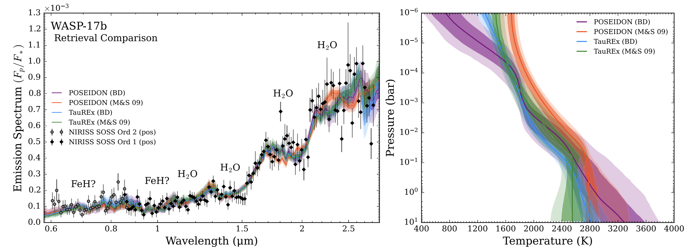

Louie et al (2025)
^^^^^^^^^^^^^^^^
`JWST-TST DREAMS: A Precise Water Abundance for Hot Jupiter WASP-17b from the NIRISS SOSS Transmission Spectrum`
`ADS Link <https://ui.adsabs.harvard.edu/abs/2024arXiv241203675L/abstract>`_
Utilized: Free chemistry transmission retrieval, Mie-scattering aerosols, dataset offsets
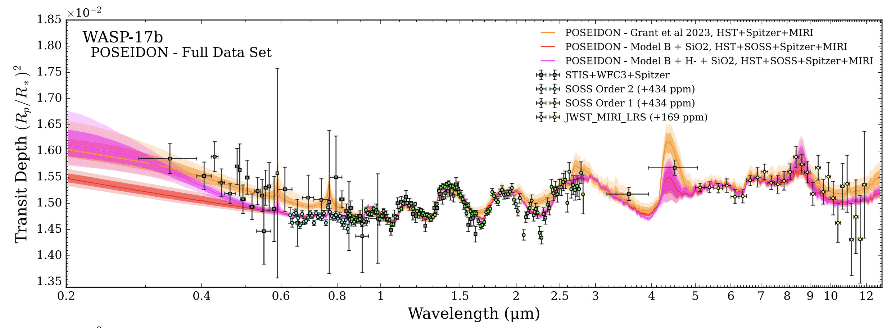

Bennett et al (2025)
^^^^^^^^^^^^^^^^
`An HST Transmission Spectrum of the Closest M Dwarf Transiting Rocky Planet LTT 1445Ab`
`ADS Link <https://ui.adsabs.harvard.edu/abs/2025AJ....169..111B/abstract>`_
Utilized: Free chemistry transmission retrieval, CLR prior
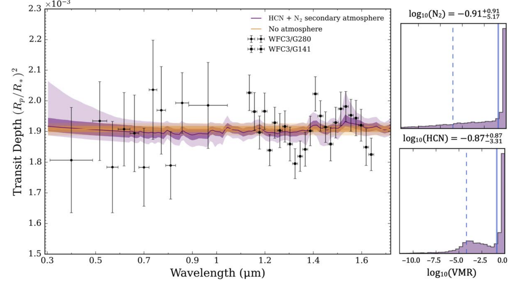

Perdelwitz et al (2025) 
^^^^^^^^^^^^^^^^
`The Influence of Stellar Chromospheres and Coronae on Exoplanet Transmission Spectroscopy`
`ADS Link <https://ui.adsabs.harvard.edu/abs/2025arXiv250200553P/abstract>`_
Utilized: Stellar contamination
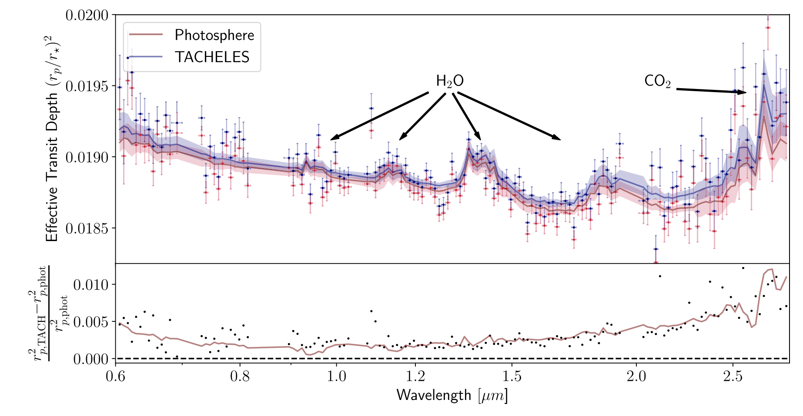

Cañas et al (2025)
^^^^^^^^^^^^^^^^
`GEMS JWST: Transmission spectroscopy of TOI-5205b reveals significant stellar contamination and a metal-poor atmosphere`
`ADS Link <https://ui.adsabs.harvard.edu/abs/2025arXiv250206966C/abstract>`_
Utilized: Chemical equilibrium transmission retrieval with stellar contamination, contribution visuals 
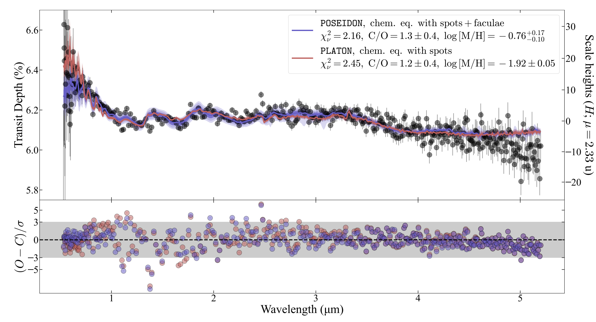

Vilovic et al (2025)
^^^^^^^^^^^^^^^^
`Superhabitable Planets Around Mid-Type K Dwarf Stars Enhance Simulated JWST Observability and Surface Habitability`
`ADS Link <https://ui.adsabs.harvard.edu/abs/2025AN....34640081V/abstract>`_
Utilized: Transmission forward models, JWST synthetic data, free chemistry transmission retrieval 
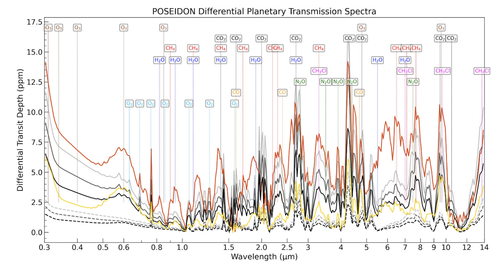

POSEIDON 1.3 Released! (4/2025) (Lead Developers: Ruizhe Wang, Ryan MacDonald)

Wang et al (2025)
^^^^^^^^^^^^^^^^
`Open-source High-resolution Exoplanet Atmosphere Retrievals with POSEIDON`
`ADS Link <https://ui.adsabs.harvard.edu/abs/2025AJ....169..328W/abstract>`_
Developed: High resolution retrievals, atomic cross sections
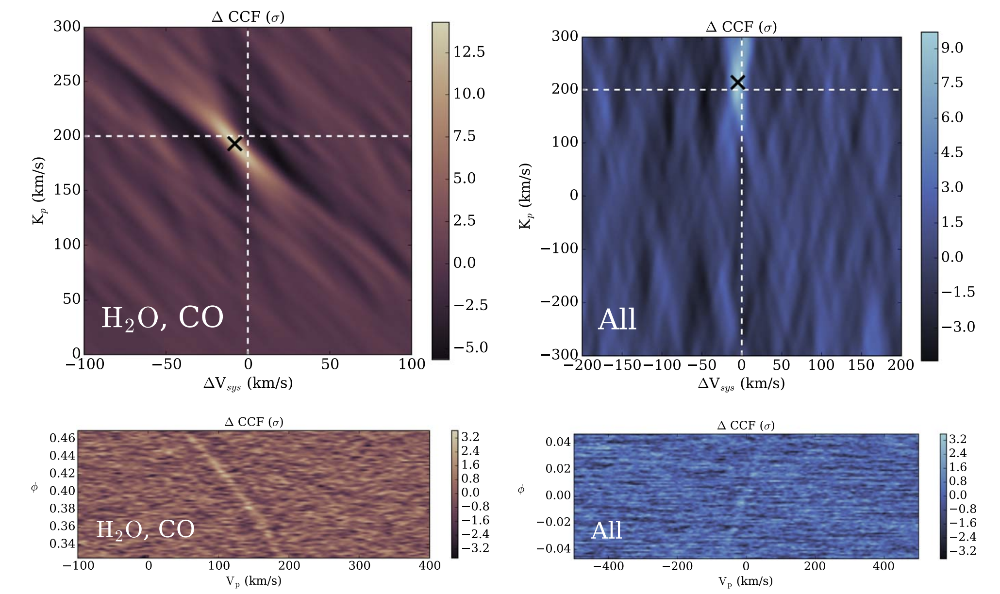

Limbach et al (2025)
^^^^^^^^^^^^^^^^
`Thermal Emission and Confirmation of the Frigid White Dwarf Exoplanet WD 1856+534 b`
`ADS Link <https://ui.adsabs.harvard.edu/abs/2025ApJ...984L..28L/abstract>`_
Utilized: Blackbody and single-stream thermal emission retrieval
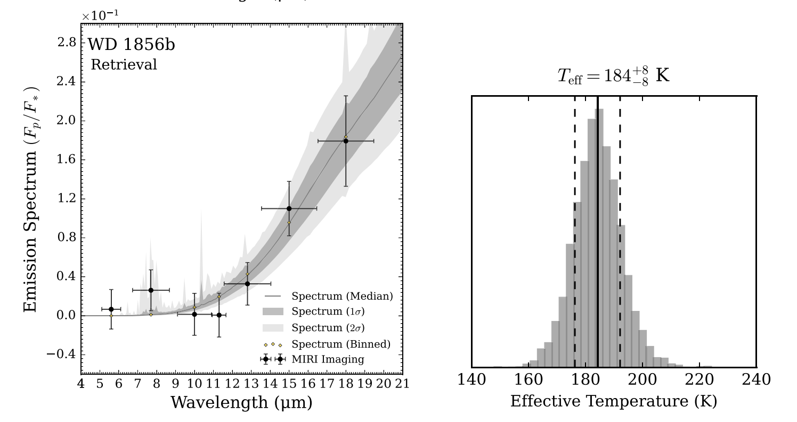

Ahrer et al (2025)
^^^^^^^^^^^^^^^^
`Escaping Helium and a Highly Muted Spectrum Suggest a Metal-enriched Atmosphere on Sub-Neptune GJ 3090 b from JWST Transit Spectroscopy`
`ADS Link <https://ui.adsabs.harvard.edu/abs/2025ApJ...985L..10A/abstract>`_
Utilized: Free chemistry transmission retrievals

Meech et al (2025)
^^^^^^^^^^^^^^^^
`BOWIE-ALIGN: substellar metallicity and carbon depletion in the aligned TrES-4b with JWST NIRSpec transmission spectroscopy`
`ADS Link <https://ui.adsabs.harvard.edu/abs/2025MNRAS.539.1381M/abstract>`_
Utilized: Free chemistry and equilibrium chemistry transmission retrievals, spectral and pressure contribution visuals 
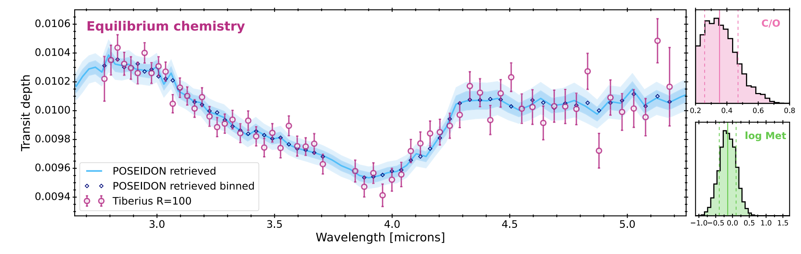

Mullens et al (2025)
^^^^^^^^^^^^^^^^
`Life after death: Europa in the evolving habitable zone of a Red Sun`
`ADS Link <https://ui.adsabs.harvard.edu/abs/2025MNRAS.540.1329M/abstract>`_
Utilized: Transmission and emission (multiple scattering, reflection) forward models, Mie-scattering aerosols, surface reflection and emission (beta)
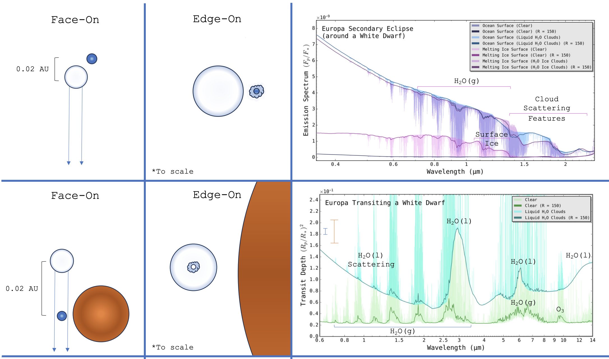

POSEIDON 1.3.1 Released! (July 2025) (Lead Developers: Elijah Mullens)

Mullens & Lewis (2025)
^^^^^^^^^^^^^^^^
`Silicate Sundogs: Probing the Effects of Grain Directionality in Exoplanet Observations`
`ADS Link <https://ui.adsabs.harvard.edu/abs/2025ApJ...988L..43M/abstract>`_
Developed: Updated aerosol database, directional and temperature dependent aerosols
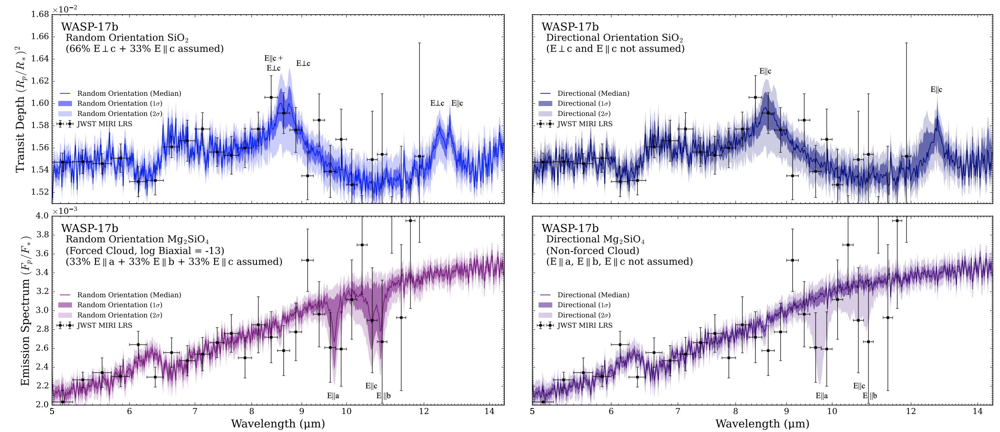

Baracchi et al (2025)
^^^^^^^^^^^^^^^^
`Estudio detallado de la atmósfera de WASP-39 b utilizando el código POSEIDON y datos del JWST`
`ADS Link <https://ui.adsabs.harvard.edu/abs/2025BAAA...66...53B/abstract>`_
Utilized: Free chemistry transmission retrievals
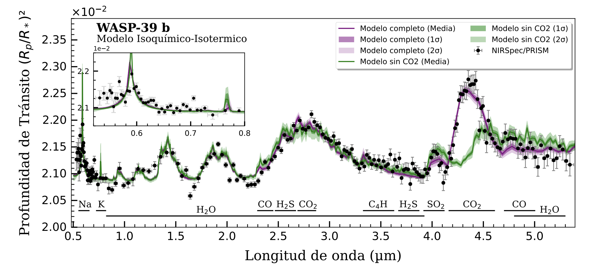

Verma et al (2025)
^^^^^^^^^^^^^^^^
`A Detailed Investigation of HD 209458 b HST and JWST Transmission Spectra with SANSAR`
`ADS Link <https://ui.adsabs.harvard.edu/abs/2025AJ....170...69V/abstract>`_
Utilized: POSEIDON opacities and retrieval capabilities to benchmark 

Gascón et al (2025)
^^^^^^^^^^^^^^^^
`The HUSTLE Program: The UV to Near-IR Transmission Spectrum of the Hot Jupiter KELT-7b`
`ADS Link <https://ui.adsabs.harvard.edu/abs/2025AJ....170..178G/abstract>`_
Utilized: Free chemistry transmission retrieval with stellar contamination, 
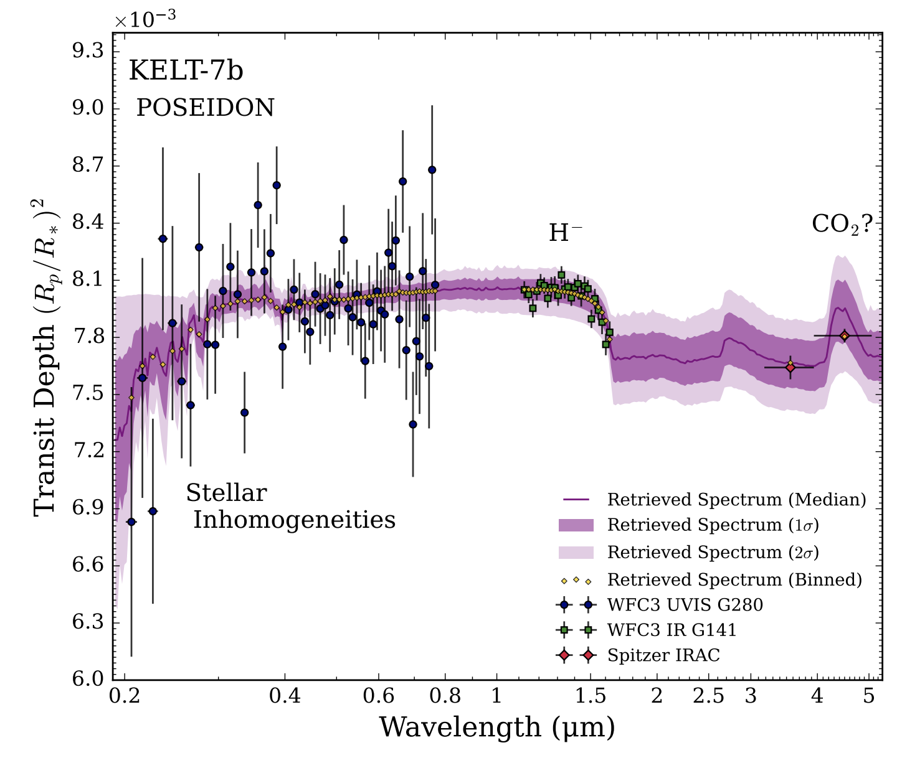

Glidden et al (2025)
^^^^^^^^^^^^^^^^
`JWST-TST DREAMS: Secondary Atmosphere Constraints for the Habitable Zone Planet TRAPPIST-1 e`
`ADS Link <https://ui.adsabs.harvard.edu/abs/2025ApJ...990L..53G/abstract>`_
Utilized: Free chemistry transmission retrieval, CLR prior, ghost background gas to retrieve mmw 
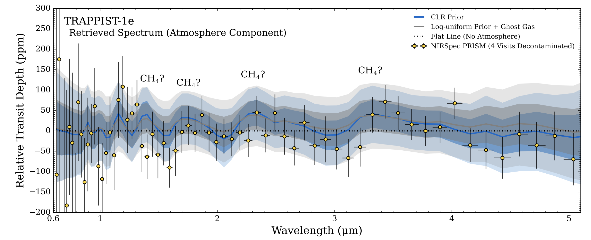

Espinoza et al (2025)
^^^^^^^^^^^^^^^^
`JWST-TST DREAMS: NIRSpec/PRISM Transmission Spectroscopy of the Habitable Zone Planet TRAPPIST-1 e`
`ADS Link <https://ui.adsabs.harvard.edu/abs/2025ApJ...990L..52E/abstract>`_
Utilized: Free chemistry transmission retrieval, CLR prior
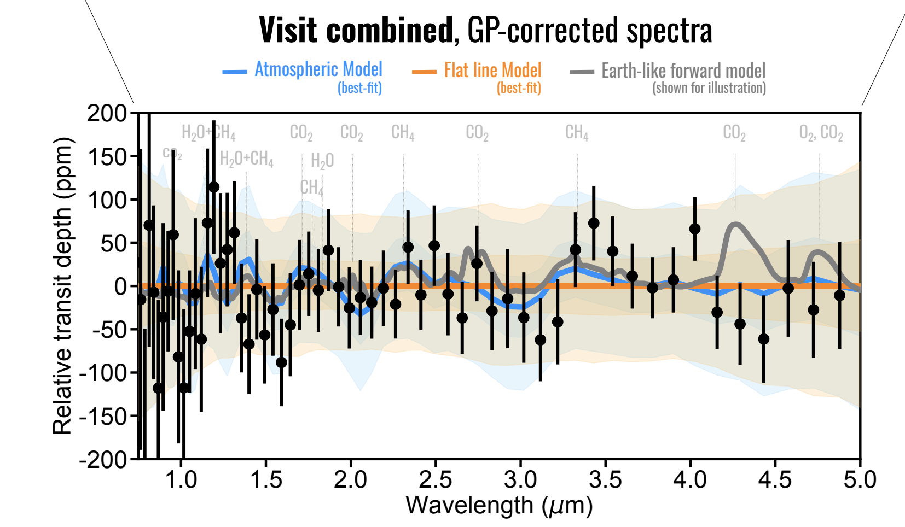

Meynardie et al (2025)
^^^^^^^^^^^^^^^^
`Ross 458c: Gas Giant or Brown Dwarf?`
`ADS Link <https://ui.adsabs.harvard.edu/abs/2025arXiv250922803M/abstract>`_
Utilized: Free chemistry emission (multiple scattering) retrieval, Mie-scattering clouds, slope PT profile
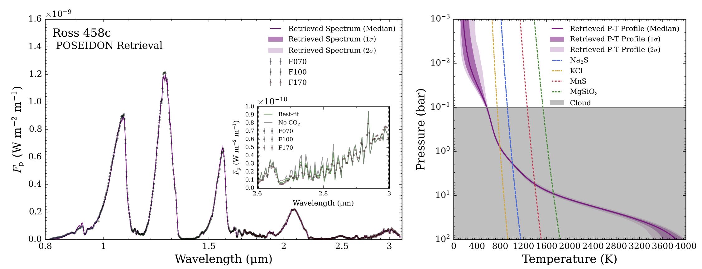

Gressier et al (2025)
^^^^^^^^^^^^^^^^
`JWST-TST DREAMS: Sulfur dioxide in the atmosphere of the Neptune-mass planet HAT-P-26 b from NIRSpec G395H transmission spectroscopy`
`ADS Link <https://ui.adsabs.harvard.edu/abs/2025arXiv250916082G/abstract>`_
Utilized: Free chemistry transmission retrieval, spectral contribution visuals
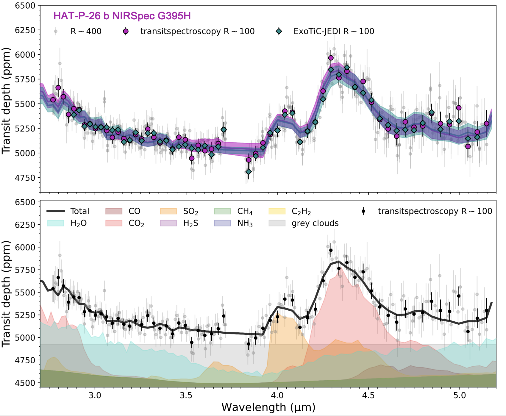

Bennet et al (2025)
^^^^^^^^^^^^^^^^
`Additional JWST/NIRSpec Transits of the Rocky M Dwarf Exoplanet GJ 1132 b Reveal a Featureless Spectrum`
`ADS Link <https://ui.adsabs.harvard.edu/abs/2025AJ....170..205B/abstract>`_
Utilized: Free chemistry transmission retrieval with stellar contamination, CLR prior, 'ghost' gas
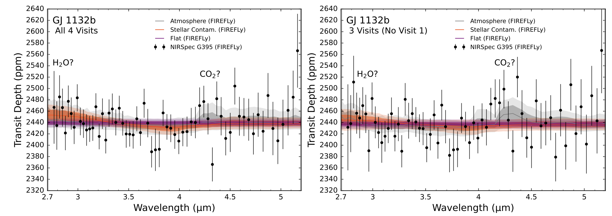

Van Sluijis et al (2025)
^^^^^^^^^^^^^^^^
`First Results from WINERED: Detection of Emission Lines from Neutral Iron and a Combined Set of Trace Species on the Dayside of WASP-189 b`
`ADS Link <https://ui.adsabs.harvard.edu/abs/2025AJ....170..217V/abstract>`_
Utilized: POSEIDON for Ti+ cross section

Lustig-Yaeger et al (2025)
^^^^^^^^^^^^^^^^
`JWST-TST DREAMS: The Nightside Emission and Chemistry of WASP-17b`
`ADS Link <https://ui.adsabs.harvard.edu/abs/2025arXiv251006169L/abstract>`_
Utilized: Free chemistry emission (single-stream) retrievals, Guillot PT profile, pressure contribution visuals
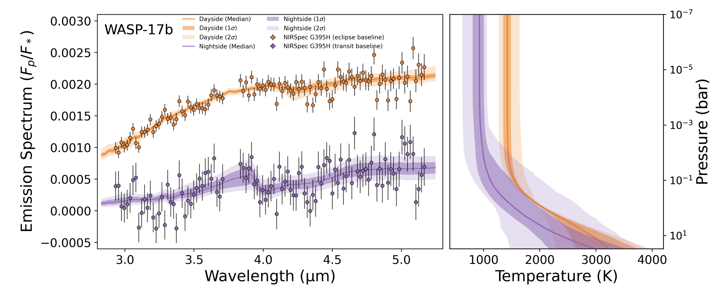

Ashtari et al (2025)
^^^^^^^^^^^^^^^^
`Heat Reveals What Clouds Conceal: Global Carbon & Longitudinally Asymmetric Chemistry on LTT 9779 b`
`ADS Link <https://ui.adsabs.harvard.edu/abs/2025arXiv251004863A/abstract>`_
Utilized: Free chemistry (single-stream) emission retrievals, Madhusudhan & Seager PT profile, Guillot PT profile, spectral and pressure contribution visuals 
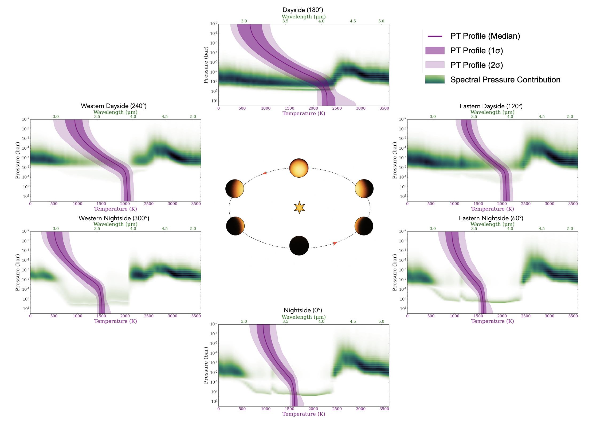

Stevenson et al (2025)
^^^^^^^^^^^^^^^^
`K2-18b Does Not Meet the Standards of Evidence for Life`
`ADS Link <https://ui.adsabs.harvard.edu/abs/2025AJ....170..257S/abstract>`_
Utilized: Free chemistry transmission retrieval
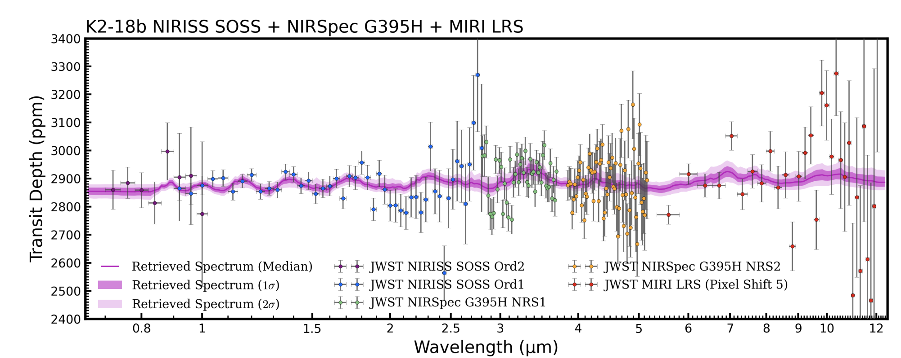

Ahrer et al (2025)
^^^^^^^^^^^^^^^^
`BOWIE-ALIGN: weak spectral features in KELT-7b's JWST NIRSpec/G395H transmission spectrum imply a high cloud deck or a low-metallicity atmosphere`
`ADS Link <https://ui.adsabs.harvard.edu/abs/2025MNRAS.543.2442A/abstract>`_
Utilized: Free chemistry and equilibrium chemistry transmission retrievals, dataset offset, spectral contribution visuals, gray clouds
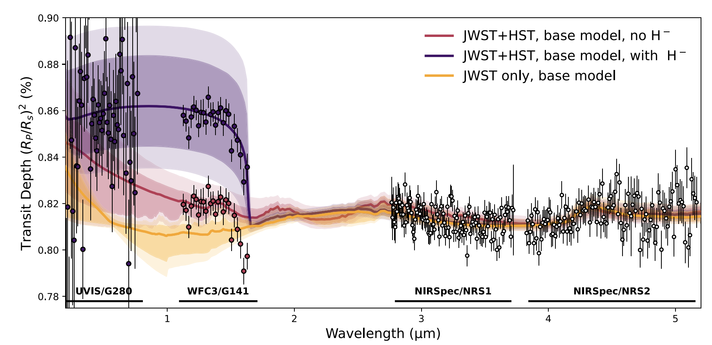